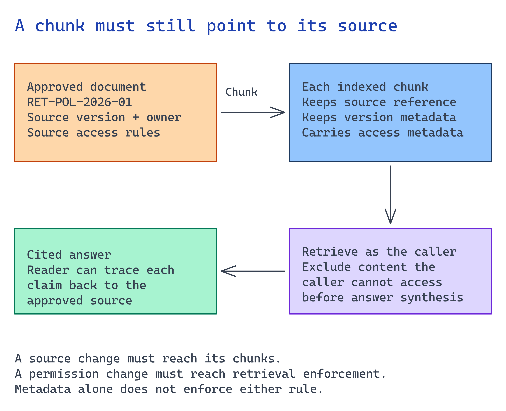

# Module 3. Ingest and index approved content

Connect the source chosen in module 2. Preserve the metadata reviewers need to audit answers
and set a refresh schedule. Test that retrieval returns the current policy rather than a
superseded version.



## What you build

1. An ingestion path from the approved source into a retrievable store.
2. Chunking, embedding, and metadata that survive into the answer as a citation.
3. A refresh schedule, and a documented worst-case staleness window.
4. A retrieval smoke test proving the corpus answers the questions it should and returns nothing
   for the questions it should not.

## Choose your path

| Option | Who writes the pipeline | Chunking control | Freshness model | Effort |
| --- | --- | --- | --- | --- |
| **A. Foundry IQ managed ingestion** *(default)* | The platform generates the data source, skillset, indexer, and index | Platform-chosen; `contentExtractionMode` is your main lever | `ingestion_schedule` on the knowledge source | Lowest |
| B. Azure AI Search indexer (pull) | You define the index + skillset; the indexer runs it | Full, via a split skill in the skillset | Indexer schedule + change detection | Medium |
| C. Push API with custom chunking | You own chunking, embedding, and upload | Total | You own it; nothing runs unless you run it | High |
| D. Content Understanding preprocessing, then B or C | You, plus a preprocessing pass | Total, over a much richer extraction | Two-stage | Highest |
| E. Remote knowledge source, no ingestion | Nobody | N/A: nothing is chunked | Always fresh by construction | Lowest |

**Default: Option A.** A blob knowledge source generates the data source, skillset, indexer, and
index, and carries permission metadata forward when requested.

**Choose B when** you need a specific field schema, scoring profile, or custom enrichment skill but
still want scheduled pull ingestion. An index built this way can later be wrapped as a *search index
knowledge source*, so moving from B to A can reuse it.

**Choose C when** content comes from an unsupported store, such as an API, database join, or CMS, or
when a rule or clause must remain in one chunk. Contracts, legal clauses, and numbered policy
documents often need this. Your team also owns refresh.

**Choose D when** the source is not really text: scanned PDFs, forms, tables, or screenshots.
Extract structure first, then index the structured output. Do not feed raw OCR output into an index
and hope semantic ranking fixes it.

**Choose E when** the content changes faster than your refresh schedule, or when the platform that
owns it already answers questions well (SharePoint, a Fabric data agent, Work IQ). Remote sources
are slower per query and always current. For live operational data this is the only correct answer.

**Migration cost.** Moving from A to B rebuilds the pipeline but keeps the knowledge base and agent.
Moving from B to A can reuse the index. Moving away from C also requires reviewing the evaluation
set because its tests depend on chunking choices. One knowledge base can combine an indexed blob
source and a remote SharePoint source through the same ranking pipeline.

### The four things that must survive ingestion

Whatever option you choose, every retrievable chunk needs these fields. Without them, you cannot
audit the answer:

| Field | Why | Failure if missing |
| --- | --- | --- |
| `source` / document id | The citation the user clicks | "Trust me" answers |
| Version or effective date | Lets the model prefer the current policy | Confident answers from superseded documents |
| Permission metadata (`userIds` / `groupIds`) | Query-time ACL filtering (module 2) | Everyone sees everything |
| Chunk position / parent doc | Lets a reviewer find the passage in context | Reviewers cannot verify a disputed answer |

## Implementation

Use current Microsoft Learn guidance for the ingestion and indexing APIs.

### Connect your approved source

Use the source and provisional embedding configuration selected before provisioning. Implement
the selected connector in the customer environment, preserving source IDs and versions.
Include one current document, an older revision, and a restricted item in the approved test set.
Configure actual source permissions; labels in a file do not enforce access.

Run ingestion or refresh, then inspect the stored source reference and permission metadata.
Change or withdraw one test document and verify that retrieval changes within the agreed window.
For a remote source, test this through its query path without creating an unnecessary index.

For module 2's Copilot Studio branch, inspect the connected SharePoint knowledge and repeat
the source-update and denied-user checks there. The Azure commands below do not apply.

### Optional reference corpus check

To inspect the supplied scripts separately, seed an isolated container with the four fictional
source documents. Exclude the sample README.
The current notice names a superseded notice, but the older document is not included.
The supervisor document is labelled restricted; configure real source permissions before testing access.

Run commands from the repository root.

```bash
az storage blob upload-batch \
  --account-name "$AZURE_STORAGE_ACCOUNT_NAME" \
  --auth-mode login \
  --destination "$AZURE_STORAGE_CONTAINER_NAME" \
  --source scenarios/ai-grounding/accelerator/sample-data \
  --pattern "returns-*.md"

az storage blob upload-batch \
  --account-name "$AZURE_STORAGE_ACCOUNT_NAME" \
  --auth-mode login \
  --destination "$AZURE_STORAGE_CONTAINER_NAME" \
  --source scenarios/ai-grounding/accelerator/sample-data \
  --pattern "service-update.md"
```

The account uses `allowSharedKeyAccess: false`, so `--auth-mode login` is required. There is no
account key to fall back to.

### Option A. Foundry IQ managed ingestion (blob knowledge source)

The knowledge source generates the whole pipeline. You supply the container, the two models, and the
ingestion parameters.

**Implementation gap.** The example below uses flat Blob Storage but requests user/group ACL
ingestion. Flat blobs use container RBAC scopes; the fictional per-document role labels are not
translated into source permissions. Choose and implement that access model before using protected
content. See [Blob permission ingestion](https://learn.microsoft.com/azure/search/search-blob-indexer-role-based-access).

```bash
pip install --pre azure-search-documents azure-identity python-dotenv
```

Preview (`2026-05-01-preview`) is required for query planning, answer synthesis, and ACL carry-
forward. The GA API version (`2026-04-01`) gives minimal extractive retrieval only.

[`accelerator/scripts/build_knowledge_source.py`](../accelerator/scripts/build_knowledge_source.py):

```python
from azure.search.documents.indexes.models import (
    AzureBlobKnowledgeSource, AzureBlobKnowledgeSourceParameters,
    KnowledgeBaseAzureOpenAIModel, AzureOpenAIVectorizerParameters,
    KnowledgeSourceAzureOpenAIVectorizer, KnowledgeSourceContentExtractionMode,
    KnowledgeSourceIngestionParameters,
)

knowledge_source = AzureBlobKnowledgeSource(
    name="approved-content-ks",
    azure_blob_parameters=AzureBlobKnowledgeSourceParameters(
        connection_string=blob_connection,
        container_name=os.environ["AZURE_STORAGE_CONTAINER_NAME"],
        is_adls_gen2=False,
        ingestion_parameters=KnowledgeSourceIngestionParameters(
            chat_completion_model=KnowledgeBaseAzureOpenAIModel(
                azure_open_ai_parameters=AzureOpenAIVectorizerParameters(
                    resource_url=os.environ["AZURE_AI_FOUNDRY_ENDPOINT"],
                    deployment_name=os.environ["AZURE_AI_MODEL_DEPLOYMENT_NAME"],
                    model_name=os.environ["AZURE_AI_CHAT_MODEL_NAME"],
                )),
            embedding_model=KnowledgeSourceAzureOpenAIVectorizer(
                azure_open_ai_parameters=AzureOpenAIVectorizerParameters(
                    resource_url=os.environ["AZURE_AI_FOUNDRY_ENDPOINT"],
                    deployment_name=os.environ["AZURE_AI_EMBEDDING_DEPLOYMENT_NAME"],
                    model_name=os.environ["AZURE_AI_EMBEDDING_MODEL_NAME"],
                )),
            content_extraction_mode=KnowledgeSourceContentExtractionMode.MINIMAL,
            ingestion_permission_options=["user_ids", "group_ids"],
        ),
    ),
)
index_client.create_or_update_knowledge_source(knowledge_source)
```

Then the knowledge base that references it:

```python
knowledge_base = KnowledgeBase(
    name=os.environ["AZURE_KNOWLEDGE_BASE_NAME"],
    knowledge_sources=[KnowledgeSourceReference(name="approved-content-ks")],
    retrieval_instructions=(
        "Use approved-content-ks for questions about returns policy, exceptions, "
        "and current service notices. Prefer the most recent effective date."
    ),
    answer_instructions=(
        "Answer only from retrieved documents and cite the document id. "
        "If the documents do not contain the answer, say so plainly."
    ),
    output_mode="answerSynthesis",
    models=[KnowledgeBaseAzureOpenAIModel(azure_open_ai_parameters=chat_params)],
    retrieval_reasoning_effort=KnowledgeRetrievalLowReasoningEffort(),
)
index_client.create_or_update_knowledge_base(knowledge_base)
```

Run it:

```bash
export AZURE_KNOWLEDGE_BASE_NAME=grounding-kb
python3 scenarios/ai-grounding/accelerator/scripts/build_knowledge_source.py
```

Apply these configuration rules:

1. Create the knowledge source **before** the knowledge base.
2. A knowledge base and its sources must live on the **same search service**.
3. To delete a source, first update or delete every knowledge base referencing it.
4. Use `retrieval_instructions` to specify which source should answer each request type,
   especially when the knowledge base has several sources.
5. *(Not enforced)* Nothing stops you shipping without `ingestion_permission_options`. Module 2's
   probe is what catches that.

The generated objects appear under `azureBlobParameters.createdResources`: `datasource`, `indexer`,
`skillset`, and `index`. Record those names. Inspect them in the portal when ingestion fails, and
delete them during teardown.

**Freshness.** Set `ingestion_schedule` in the ingestion parameters. Base the interval on the
staleness window the data owner approved in module 2, not a default. If content can be no more than
an hour stale, a nightly indexer breaks that promise.

### Option B. Azure AI Search indexer (pull)

You define the index, skillset, and indexer explicitly, using the source and access rules from
module 2. This alternative needs a custom ingestion configuration; the default above uses
the scenario's knowledge-source script and does not require this work.

The shape that matters:

- An index with a **retrievable `content` field** (what the model reads), a **retrievable `source`
  field** (the citation), a filterable effective-date field, and filterable `userIds` / `groupIds`
  collections if you are enforcing ACLs.
- A skillset containing a **split skill** (your chunking policy, made explicit) and an embedding
  skill pointing at your embedding deployment.
- An indexer with a schedule and change detection.

Use moderate chunks with light overlap, and never split a rule boundary. In this corpus, the return
window, proof-of-purchase requirement, and order-record check form one rule. Splitting them can
produce answers that are individually true and collectively wrong.

### Option C. Push API with custom chunking

Your code owns everything. Use `SearchClient.upload_documents()` with chunks you produced yourself,
each carrying `content`, `source`, effective date, chunk index, parent document id, and permission
fields.

This is the only option where you can implement structure-aware chunking. Split on headings, keep
a numbered clause intact, and attach the section title to every chunk so a retrieved fragment still
says what it is about.

Without an indexer, your code owns scheduling, change detection, and ACL resync.
Re-chunk and upload changed documents. Reingest documents when their permissions change.
Run this work in a monitored job.

### Option D. Content Understanding preprocessing

When the source is scanned, tabular, or visual, extract structure first, then index the structured
output through B or C. The document workflow scenario in this kit covers extraction in depth; here
you only need the output contract: typed fields plus evidence spans, which become your `content` and
your citation anchor.

If answers about tables or forms are wrong, inspect the extracted structure before tuning ranking.
Reranking cannot repair incorrect extraction.

### Option E. Remote knowledge source (no ingestion)

Add the source to the knowledge base and skip this module's pipeline entirely. Remote SharePoint,
Fabric Data Agent, Fabric Ontology, MCP server, Work IQ, and Web are all fetched at query time
through the owning platform's API and never stored in Search.

Remote retrieval adds query latency but avoids an indexed snapshot's chunking, refresh, and ACL
staleness concerns. Use it for frequently changing information such as inventory, case status,
or live metrics.

## Verify

Wait for asynchronous ingestion to finish before querying. An unfinished indexer can return
empty results even when retrieval is configured correctly.

**1. The knowledge source and base were created.** `build_knowledge_source.py` prints one line per
object it creates or updates.

```bash
python3 scenarios/ai-grounding/accelerator/scripts/build_knowledge_source.py
```

Look for `knowledge source '...' created or updated` and `knowledge base '...' created or updated`.
A `403` on the source means the deployer principal is missing **Search Service Contributor** or
**Search Index Data Contributor**; a `403` once the source touches a model means the search service
managed identity lacks **Cognitive Services User** on the Foundry account.

**2. The auto-generated indexer finished, and processed every document.** The blob knowledge source
generates its own indexer, named after the source. Read its status directly, keyless:

```bash
TOKEN=$(az account get-access-token --scope https://search.azure.com/.default --query accessToken -o tsv)

# Find the generated indexer name (it is prefixed with the knowledge source name).
curl -s -H "Authorization: Bearer $TOKEN" \
  "$AZURE_SEARCH_ENDPOINT/indexers?api-version=2026-04-01&\$select=name" \
  | python3 -c "import sys,json;[print(i['name']) for i in json.load(sys.stdin)['value']]"

# Then read its execution status.
curl -s -H "Authorization: Bearer $TOKEN" \
  "$AZURE_SEARCH_ENDPOINT/indexers('<generated-indexer-name>')/search.status?api-version=2026-04-01" \
  | python3 -c "import sys,json;r=json.load(sys.stdin)['lastResult'];print(r['status'], r['itemsProcessed'], 'processed', r['itemsFailed'], 'failed')"
```

`success` with `itemsProcessed` equal to the approved document count and `0` failed means you can
continue. `inProgress` means ingestion is still running. Wait and re-read; do not query yet.

**3. The index actually holds documents.** A `success` status with zero documents means the indexer
ran before the blobs were uploaded.

```bash
curl -s -H "Authorization: Bearer $TOKEN" \
  "$AZURE_SEARCH_ENDPOINT/indexes('<generated-index-name>')/docs/\$count?api-version=2026-04-01"
```

A non-zero chunk count confirms indexed content exists; it need not equal the source document count.
Check source coverage separately. Zero after a successful run means re-run the indexer once content
is in the container.

## Next module

[Module 4. Compare chat and embedding choices](04-model-selection.md) picks models now that
you have a real corpus to measure them against instead of a vendor benchmark.
