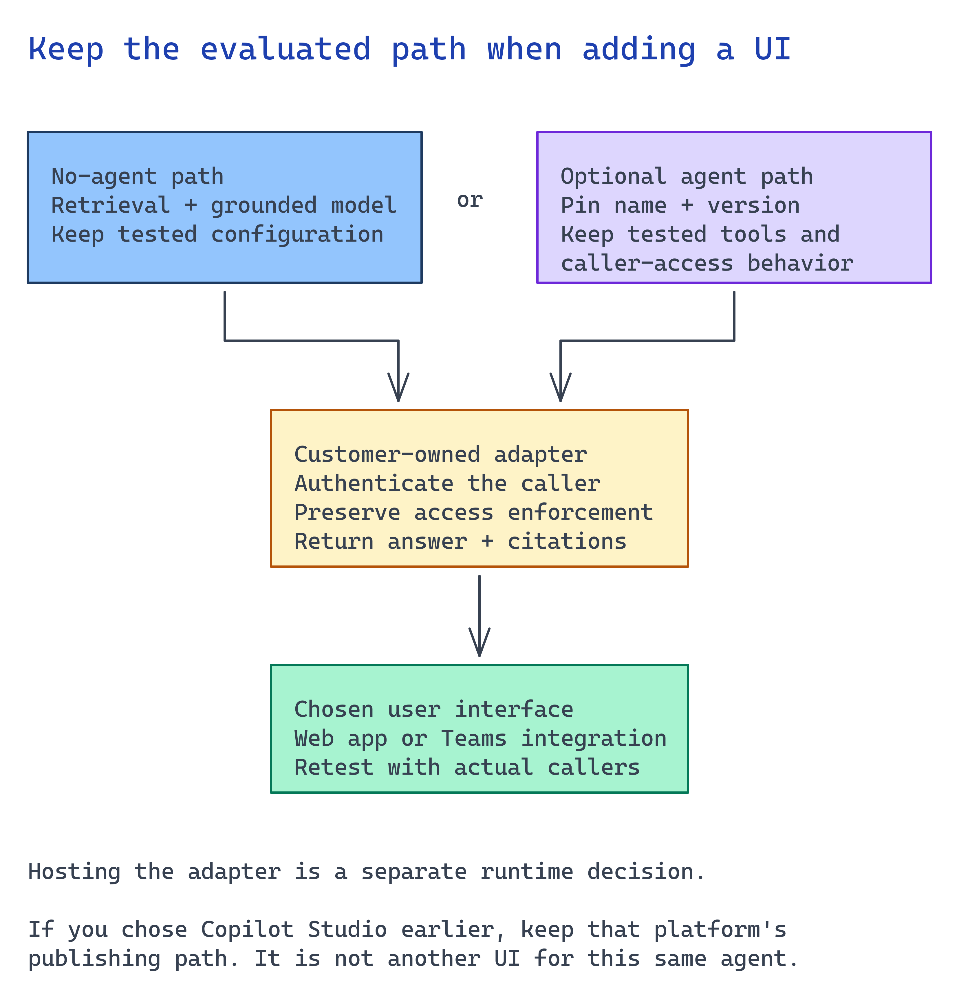

# Module 8 — Deploy and surface it to users

Module 7 proved the assistant is good enough. This module decides whether anyone uses it: **where do
people meet it, and who runs it?**

Carry forward the path tested in module 7. If you skipped the agent, keep the retrieval
function in your application; do not create an agent merely to expose it.



## What you build

1. A chosen surface, with users able to ask a real question through it.
2. A pinned agent version and a rollback that takes minutes instead of a redeploy.
3. A runnable HTTP check proving anonymous callers are rejected, authorized callers work, and restricted callers cannot see protected content.
4. A named triage owner and a pilot exit criterion.

## Choose your path

| Option | Where users meet it | Effort | When it wins |
| --- | --- | --- | --- |
| **A. Call the agent from your own app or API** *(default)* | Whatever front end you already have | Lowest — the agent is already deployed | Pilots with one consumer, or an existing app to extend |
| B. Publish the Foundry agent to Teams and Microsoft 365 Copilot | Teams and the M365 Copilot app | Low | Users already work there and you want zero new app adoption |
| C. Copilot Studio agent published to the same channel | Teams and the M365 Copilot app | Low | Module 2 chose the SharePoint/M365 path, so there is no Azure retrieval layer to front |
| D. Foundry hosted agent | A dedicated authenticated endpoint | Medium | Per-agent identity, container control, or an endpoint other teams consume |
| E. Custom web UI | A purpose-built app | Medium–high | Stakeholder demo, custom auth flow, or a required response contract |
| F. Hosted long-running workflow | Background job handle + later retrieval | High | The work outlives an interactive request |

**Default: option A.** A new surface for a one-consumer pilot does not show whether the pilot is
valuable. If a Python script and stakeholder in a room answer "is this useful?", start there.

**Choose B when users work in Teams.** Foundry can publish your existing agent directly to Teams and
Microsoft 365 Copilot, build the Teams app package, and keep using the stable endpoint. You do not
rebuild the assistant or discard modules 3 through 6.

**Choose C only if module 2 chose Copilot Studio.** If the source decision was SharePoint and M365,
rather than an Azure retrieval layer, the agent already lives in Copilot Studio and publishes to the
same Teams and Microsoft 365 Copilot channel. Do not build a Copilot Studio agent over an existing
Azure retrieval stack. You would have two grounding layers.

**A declarative agent in Microsoft 365 Copilot is a different product decision, not a fifth doorway.**
It grounds directly on SharePoint and Graph content. It redoes module 3 with different rules and
discards your index, chunking, and citation metadata. Use it when you never needed an Azure retrieval
layer. If you built one and want it in Teams, use option B.

**API Management is a wrapper, not a surface.** Put it in front of option A or D when your
organization standardizes AI endpoints behind one gateway. It changes where throttling and policy are
enforced, not where users meet the agent.

**Migration cost is low.** A → B is a publish action. A → D repackages the agent behind a dedicated
endpoint. D → F adds an asynchronous job contract when a workflow must continue after the user
leaves. In every case, the agent, grounding, evaluation gate, and release-contract manifest stay the
same. The surface is a late, reversible decision, which is why it belongs in module 8.

## Implementation

Whichever doorway you choose, these five rules stay fixed:

- **No keys.** Entra identity or managed identity, both in the surface and behind it.
- **The permission boundary from module 2 still applies.** A surface is a new place for it to leak.
- **Tracing carries into the runtime.** The env flags must be set there too, before the SDK loads.
- **Pin the agent version.** Not just the name.
- **Rollback is a repoint, not a redeploy.**

> Foundry and Microsoft 365 publishing surfaces move quickly and some capabilities are preview.
> Check current Microsoft Learn guidance before you run any of these steps rather than copying a
> signature from here.

### Option A — Call the agent from your own app or API

If module 6 created an agent, your application calls that pinned version:

```python
resp = openai.responses.create(
    input=question,
    extra_body={"agent_reference": {
        "name": os.environ["AZURE_FOUNDRY_AGENT_NAME"],
        "version": os.environ["AZURE_FOUNDRY_AGENT_VERSION"],
        "type": "agent_reference",
    }},
)
```

Pin the agent version in application configuration, not just its name. Otherwise a debugging version
can silently become production. Your app authenticates users and the agent authenticates your app.
Define both before this counts as a surface.

For the no-agent path, call module 5's `grounded_answer.answer` function from your existing
backend with the caller's verified search token. Keep the `KnowledgeBaseRetrievalClient`
and knowledge-base name from module 7's retrieval capture. Return the answer and citations;
do not replace the user's identity with one shared privileged identity.

The customer application adapter is integration work. The capture script can demonstrate
answers locally, but a script alone is not an authenticated deployed surface. Complete the
HTTP checks below before describing this path as deployed.

### Option B — Publish the Foundry agent to Teams and Microsoft 365 Copilot

Foundry publishes the agent's **stable endpoint**, so users always talk to one consistent agent while
you roll new versions behind it. Publishing compiles a Teams app manifest, submits it to the Microsoft
365 Copilot and Teams catalogs, and enables the activity protocol the channels need.

Two things to decide before you click publish:

| Decision | Options | What it changes |
| --- | --- | --- |
| Active version | A pinned version, or always-latest | Always-latest means your next debugging version reaches users. Pin it for a pilot |
| Who can use it | Just you, or people in your organization | Just you is immediate and shareable by link. Organization-wide requires Microsoft 365 admin approval and appears under **Built by your org** |

For a pilot, **pin the version, publish to "just you", then share the link** with the named pilot
group. It needs no admin approval and keeps the audience to the size in the manifest.

Publishing creates an Azure Bot Service resource. It needs permissions Foundry roles do not grant:
the **Azure Bot Service Contributor** role on the resource group and the `Microsoft.BotService`
provider registered on the subscription. Set this up before the demo.

Rolling out a new version later is a version-selector change in Foundry. The endpoint URL does not
change and you do not republish. That is also your rollback.

Publishing means Microsoft 365 and Teams process and store agent responses and metadata under their
terms and data-residency commitments. If the corpus needed module 2's permission work, include this
in the same review.

Full steps: [Publish agents to Microsoft 365 Copilot and Microsoft Teams](https://learn.microsoft.com/azure/foundry/agents/how-to/publish-copilot).
If the project disables public network access, portal publishing is unavailable and you use the REST
flow instead.

### Option C — Copilot Studio agent in Teams

Only relevant if module 2 landed on Copilot Studio and SharePoint. Publish the agent once, then
connect it to the **Teams and Microsoft 365 Copilot** channel; leaving the Microsoft 365 option
selected makes it available in both, and clearing it limits it to Teams. Turn on end-user
authentication so people outside the organization cannot reach it. Organization-wide distribution
goes through Microsoft 365 admin approval, same as option B.

### Option D — Foundry hosted agent

Package the agent as a container with its own Entra identity and a dedicated endpoint. Take this
route when another team needs to call the agent as a service, or when you need control over the
runtime. This is an optional packaging change; retain the scenario corpus and evaluated behavior.

In a new working directory outside this repository, initialize the official Responses host:

```bash
azd auth login
azd ext install microsoft.foundry
HOSTED_DIR="$(mktemp -d)"
cd "$HOSTED_DIR"
azd ai agent init \
  -m https://github.com/microsoft-foundry/foundry-samples/blob/main/samples/python/hosted-agents/agent-framework/responses/01-basic/azure.yaml \
  --deploy-mode code
```

Select the existing scenario project and model. Change into the generated directory printed
by the wizard. Replace the sample handler with this scenario's evaluated answer path; keep
the generated protocol host and Dockerfile. Configure its existing knowledge source and
preserve the caller's access checks. A generic chat sample is not the grounding application.

Review the hosted service in the generated `azure.yaml`, then run:

```bash
azd provision
azd ai agent run
```

Try the coordinator and supervisor questions locally. Stop the local server, run `azd deploy`,
and record the deployed version and per-agent principal ID. Assign only the required source
permissions and repeat the surface checks below against the reported endpoint.
Current setup:
<https://learn.microsoft.com/azure/foundry/agents/quickstarts/quickstart-hosted-agent>

Carry the tracing env into the deployment or you lose the observability you built in module 7:

```bash
export AZURE_EXPERIMENTAL_ENABLE_GENAI_TRACING=true
export OTEL_INSTRUMENTATION_GENAI_CAPTURE_MESSAGE_CONTENT=true
```

### Option E — Custom web UI

A purpose-built front end over option A. Use it for a stakeholder demo where the interface matters,
or when you need a response contract Teams cannot express. Build the minimum UI over option A:
question input, answer with source links, visible refusal, and an explicit request-error state.
Keep tokens on the server and preserve the caller's identity. The trap is
authentication: a demo UI that calls the agent with a service identity has quietly deleted module 2's
permission boundary, because every user now looks like the same identity. Pass the signed-in user
through, or say out loud that the demo is not permission-accurate.

### Option F — Hosted long-running workflow

Use this only when the task is genuinely asynchronous: batch review, overnight queue processing,
large corpus refresh, or a workflow a user should submit and check later. It needs persisted
job state, an opaque handle, and authorization on every status/result read. Add cancellation
and a bounded retry policy before exposing it. This extension is outside the interactive
default; do not use it to hide ordinary chat latency.

### Re-prove the permission boundary here

Run the surface probe against the doorway a real user uses. This is where per-user identity can get
lost. The retrieval probe still proves the search boundary. This check proves the surface preserves
it.

## Verify

This check catches a doorway that lets anyone in or calls the agent with one service identity, making
every user's documents visible to everyone. Prove the surface refuses anonymous callers and still
trims by user.

**1. Define the HTTP request and expected evidence.** Copy
[`surface-probe.json`](../accelerator/surface-probe.json) and change its request method, headers,
and JSON body to match the deployed surface. Put the full deployed URL, including its route, in
`--endpoint`. The script does not assume a route or response schema.

Set `expected_statuses` for all three callers. The authorized case must contain a marker from an
approved response. The restricted case must reject the caller or return a payload without every
restricted marker. Keep the markers specific enough to catch a title, answer text, or citation that
would reveal protected content.

**2. Get one authorized token and one restricted token for the surface's accepted Entra audience.**
Store each token in a different environment variable. Do not put tokens in the plan, on the command
line, or in a shell history. The script takes only the variable names and does not print credentials
or response payloads.

**3. Run the fail-closed check.**

**Transport gap:** the current probe accepts HTTP and follows redirects with the caller's
authorization header. Enforce HTTPS and safe redirect handling before using real tokens.

Run commands from the repository root.

```bash
python3 scenarios/ai-grounding/accelerator/scripts/probe_surface.py \
  --endpoint "https://<your-surface>/<route>" \
  --plan scenarios/ai-grounding/accelerator/surface-probe.json \
  --authorized-token-env SURFACE_AUTHORIZED_TOKEN \
  --restricted-token-env SURFACE_RESTRICTED_TOKEN \
  --timeout-seconds 20
```

The check sends the plan's request three times: without credentials, with the authorized token, and
with the restricted token. Each call has its own timeout. It prints a `PASS` or `FAIL` line for the
HTTP status and each payload marker, then exits nonzero for any missing caller input, invalid plan,
request error, timeout, status mismatch, or content leak.

An anonymous `401` or `403`, an authorized `200` with the expected marker, and no restricted marker
are the minimum evidence. If the surface uses another credential header or scheme, pass
`--auth-header` or `--auth-scheme` to match it. A surface that cannot expose a callable HTTP route
cannot use this verifier; test the protocol adapter that backs the user channel instead.

**4. No key crept back in.** Confirm the deployed surface authenticates with a managed identity, not a
key, and that its configuration carries no secrets:

```bash
az webapp identity show --name <surface-app> --resource-group "$AZURE_RESOURCE_GROUP" \
  --query "type" -o tsv
az webapp config appsettings list --name <surface-app> --resource-group "$AZURE_RESOURCE_GROUP" \
  --query "[?contains(name, 'KEY') || contains(name, 'CONNECTION_STRING')].name" -o tsv
```

Look for an identity `type` of `SystemAssigned` (or `UserAssigned`). Review any setting names returned
by the second command; the name alone does not prove a credential is present. This scenario uses an
Application Insights connection string for telemetry, including in its project connection.
Use managed identity for resource access and review telemetry authentication separately.
Adjust the commands for the surface you deployed (Container Apps, Function App, or Bot Service).

## Next module

There is no required next module. If the deployed surface passes these checks, review the
pilot with its owners. Keep unresolved integrations and operating requirements explicit.
Return to [module 1](01-provision-foundation.md) when the approved corpus or scope changes.
