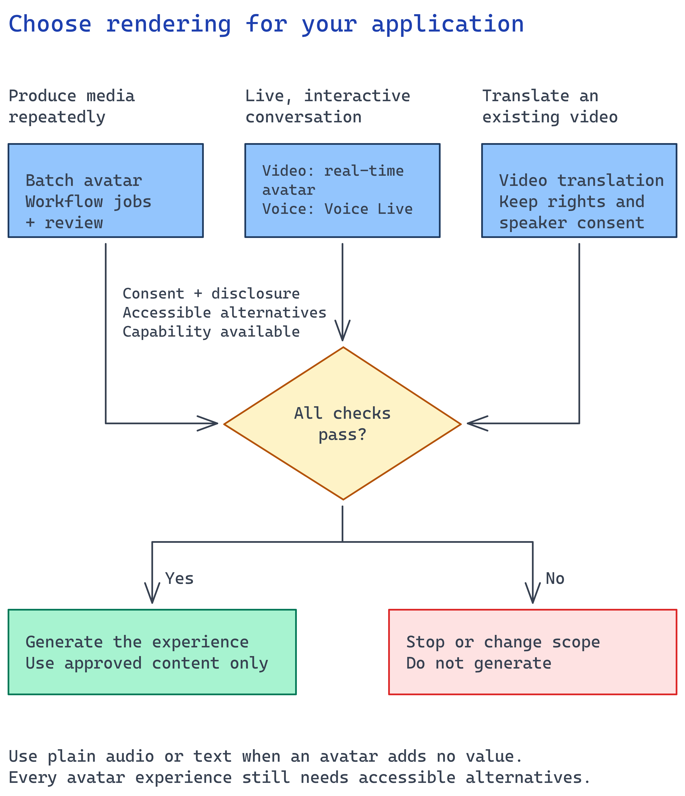

# Module 1 - Choose the application your users need

Start with one communication or support task in your organization. Decide what users should
be able to do afterward and where they will use the experience. A presenter may help explain a
process. A searchable page may solve the same problem with less work.

**Choose the application goal before the media format.** Build either an interactive assistant
or a repeatable content-production application. Neither is the default. A generated video is an
output; producing one file does not meet this track's application delivery goal.

## What you build

An agreed delivery scope for an application in **your tenant**. Identify its audience,
delivery channel, approved content owner, and acceptance checks. Keep the decision
in your existing delivery backlog or design record.

Bring one representative message, the intended user task, and the owners of the target channel
and Azure environment. No API calls or resource deployment are needed in this module.

## Choose your path

### First choose the application goal

| Application | Choose it when | What you deliver |
| --- | --- | --- |
| **Interactive assistant** | Users need to ask questions or get help completing a task. | An authenticated application connected to approved knowledge, with bounded answers and a human-help route. Add an avatar only when a visible presenter helps the user. |
| **Content-production application** | Content owners need to generate and maintain communication repeatedly, such as updating explanations when a policy changes. | A deployed workflow that reads approved source revisions, generates media, and routes it for review and controlled publication. It tracks failures and withdraws outdated output. |

If the need is only to make one video or publish an existing page, use the customer's content
tools. Do not add AI just to fit this track.

### Then choose how the application presents content

| Experience | Choose it when | What you must build and operate |
| --- | --- | --- |
| Batch avatar video | The content-production application needs reusable videos from approved wording. | Connect source updates to generation jobs and review. Publish approved revisions through the customer's channel and handle replacement or withdrawal. Module 5 covers the rendering step. |
| Real-time avatar | People need a visible presenter that responds during an interaction, such as a support kiosk. | Build the browser experience and connect it to an answer service. Own connection failures, interruption, captions, and the user's access boundary. Module 5 identifies the integration steps; the repository does not supply this client. |
| Voice Live conversation | Users primarily want to speak and ask follow-up questions; a face is optional. | Connect approved knowledge to the conversation and build the audio client. Test turn-taking, unsupported questions, and handoff to a person. Follow modules 4 and 5 with additional client implementation. |
| Video translation | The content-production application maintains language versions of approved source videos. | Track each source revision and its localized outputs. Confirm voice/video rights, review translated meaning, and publish each locale as a separately approved revision. Use module 5's translation branch. |
| Audio or text without an avatar | The application still meets its goal without a visible presenter. | Keep the assistant's answer path or the content-production workflow, using audio or text as its output. Skip avatar provisioning. A static page alone is outside this application build. |

These are experience choices, not interchangeable API settings. Moving from video to
conversation changes how the application generates and checks answers while users interact.
Microsoft's [avatar overview](https://learn.microsoft.com/azure/ai-services/speech-service/text-to-speech-avatar/what-is-text-to-speech-avatar)
explains the rendering capabilities; [Voice Live](https://learn.microsoft.com/azure/ai-services/speech-service/voice-live)
describes the conversation path.

## Implementation

### Define the first release

Write a concrete acceptance statement with the channel owner. Use the example for your goal.

**Interactive assistant:**

> An authorized user can ask how to submit a service request through our support portal and
> receive an answer grounded in current, permitted guidance. An unsupported question reaches
> the support team. The text path works when the avatar is unavailable.

**Content-production application:**

> When a content owner approves a revised process explanation, our deployed workflow generates
> a private preview for the selected language and requests publication approval. It publishes
> only the approved revision. The owner can inspect a failed job and withdraw outdated output.

Specify the first audience and language. Then agree what remains outside this release. For
content production, choose the trigger: a source-change event, a scheduled check, or an
authorized user request. A manually submitted rendering request is an integration check, not
completion.

### Check feasibility before committing

For the selected capability, confirm region availability and your tenant's access through the
[Speech regions guidance](https://learn.microsoft.com/azure/ai-services/speech-service/regions?tabs=ttsavatar).
Check expected usage against current pricing with the environment owner. For a live
experience, include the target device and network restrictions.
Do not create resources just to complete this decision.

Start with a standard avatar and voice unless the use case requires a custom identity.
For a real person's voice or likeness, confirm authorization and the applicable
[limited-access requirements](https://learn.microsoft.com/azure/foundry/responsible-ai/speech-service/text-to-speech/limited-access)
before committing to delivery. The requirements depend on the selected capability; do not
assume approval for one voice or avatar covers another.

Agree where users see the synthetic-media disclosure and how they reach equivalent text.
Use the [disclosure guidance](https://learn.microsoft.com/azure/foundry/responsible-ai/speech-service/text-to-speech/concepts-disclosure-guidelines)
with the customer's reviewers. Keep customer content and consent evidence in approved tenant
systems, outside this public repository.

### Map the chosen path to the remaining modules

**For content production**, module 2 connects the workflow runtime and required services.
Module 3 connects source changes to approved wording. Module 4 is optional authoring assistance.
Module 5 connects generation jobs and private previews to that workflow. Module 6 enforces
publication approval and withdrawal. Module 7 proves a complete source-update cycle through
the deployed application and actual user channel.

For a live conversation, use module 4 to implement the answer boundary and module 5 to connect
the client. Approve the application's content policy and behavior in module 6; individual
spoken answers cannot wait for per-video approval.

For translation, retain the approved source video and transcript in module 3, skip drafting
unless the wording changes, and use the translation branch in module 5. For a text-only
assistant, skip Speech setup and rendering; keep the answer boundary and application checks.

Assign the client or publishing integration to an engineer now. A service choice does not
implement either path.

## Verify

The sponsor and implementation owner can name the application goal and its first user task.
For content production, they can identify the trigger and the workflow owner. For an assistant,
they can identify the question boundary and the engineer responsible for the client.
The environment owner has confirmed that the selected capability works in the approved region.
Required consent or service access is either in place or an explicit blocker.

Walk through the acceptance statement with the content owner. They must be able to explain
who approves wording, who releases the experience, and how an outdated version is withdrawn.
An unresolved channel or owner means the scope is not ready for provisioning.

## Next module

[Module 2 - Connect the required foundation](02-foundation.md). Reuse approved tenant resources
first and add only what the selected experience needs.
