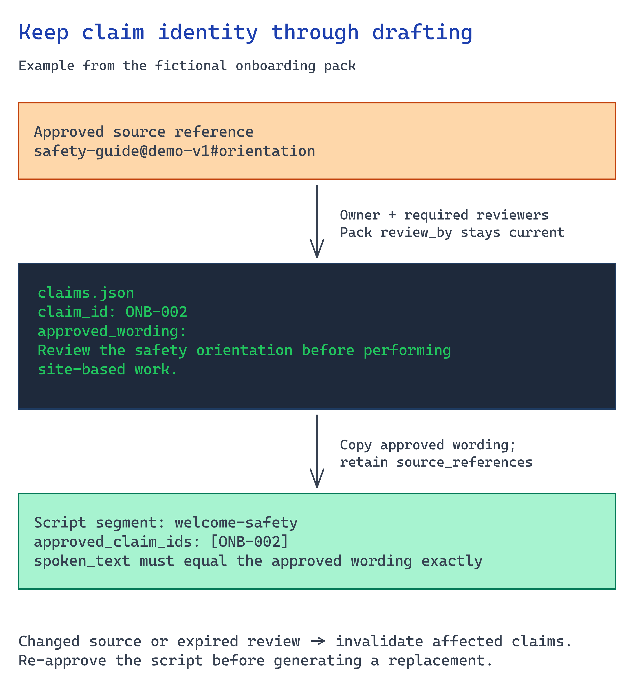

# Module 3 — Connect content and approve wording

Connect the authoritative content for your user task. Identify the owner who can approve its
wording and the audience allowed to receive it. **Approve the script content here before
generating a private media preview.** Publication approval follows in module 6.



## What you build

1. A **claim set**. It records every fact the experience may state as an atomic claim with a stable
   id, exact approved wording, authoritative source reference, named owner, required reviewers, and
   help path. Use [`accelerator/sample-data/claims.json`](../accelerator/sample-data/claims.json) as
   the template.
2. A **governed store**. It holds approved source documents in the keyless `approved-content`
   container and preserves owner/version/expiry metadata.
3. A **gate**. Nothing downstream can cite content outside the claim set. Module 5's renderer
   rejects a script segment whose spoken text is not an exact approved claim.

## Choose your path

Decide where the approved corpus lives and what governance travels with it.

| Option | Where approved content lives | Governance carried forward | Build effort | Best when |
| --- | --- | --- | --- | --- |
| **A. Blob `approved-content` + typed claim set** *(default)* | Azure Storage container from module 2 | Owner/version/expiry in claim metadata; Entra-only access | Low | You control onboarding docs and want a reviewable, exportable corpus |
| B. Foundry IQ / Azure AI Search knowledge base | Search index over blob/SharePoint/etc. | ACL sync + query-time enforcement under the caller's identity | Medium | Content spans systems and needs permission-aware retrieval (see the AI Grounding scenario) |
| C. SharePoint / M365 (Copilot-style) | Existing SharePoint libraries | Inherited M365 permissions | Lowest config | The authoritative content already lives in SharePoint and won't move |
| D. Customer system of record via export | Their HRIS/LMS export | Whatever the export preserves | Medium | Content is owned by an HR system and must stay authoritative there |

**Default: Option A.** A small, explicit, typed claim set in a keyless blob container fits
onboarding. There are few facts. Each needs a named owner and expiry date, and module 6 must approve
each one. The customer gets a corpus they can review, diff, and export. The grounded assistant
(module 4) and renderer (module 5) both use the claim set as their contract.

**Choose B** when onboarding content spans systems and needs permission-aware retrieval. The
module-4 knowledge base becomes your source of truth, and this claim set becomes the *approved
subset* the experience may speak. **Choose C** when this is a Copilot rather than an app. **Choose
D** when HR requires its system to remain authoritative. Export a versioned snapshot and never let
the avatar outrun it.

**Migration cost.** A → B is cheap: retain the claim set and add a knowledge base. B → A is also
cheap because you wrap the index. C → A/B is a rebuild. That is why A is the default.

### Four questions before writing claims

1. **Who owns each fact?** Name the person who can approve the wording and is accountable for it.
2. **What is the authoritative source?** Record the document + version that supplied the wording.
3. **When does it expire?** Set a `review_by` date after which the claim cannot publish.
4. **What happens when the source changes?** Invalidate the claim and pause the experience through
   module 6's withdrawal path. Do not silently re-render it.

## Implementation

### Option A — Blob + typed claim set (default)

**Model each claim.** The claim is the atom of approval. Exact wording lives here so the avatar can
never paraphrase a policy:

```json
{
  "claim_id": "ONB-001",
  "approved_wording": "Complete your benefits selection in the employee portal during your first week.",
  "source_reference": "benefits-guide@demo-v1#enrolment",
  "owner": "demo-benefits-owner@example.invalid",
  "required_reviewers": ["SME"],
  "help_path": "Demo Benefits Support Desk",
  "locale": "en"
}
```

The pack carries `version`, `content_owner`, and `review_by` (expiry). The sample pack uses
fictional data to show the expected shape. Keep real content and consent records in the customer's
approved systems, outside this repository.

**Upload the approved sources keylessly.** Shared-key access is disabled on the storage account.
Ingest with Entra ID:

```bash
STORAGE=$(grep AZURE_STORAGE_ACCOUNT_NAME scenarios/avatar-onboarding/accelerator/.env | cut -d= -f2)
az storage blob upload-batch \
  --account-name "$STORAGE" --auth-mode login \
  --destination approved-content \
  --source scenarios/avatar-onboarding/accelerator/sample-data
```

**Keep owner/version/expiry queryable.** Store them as blob metadata or index tags so an audit can
answer "who approved this and when does it expire" without opening files:

```bash
az storage blob metadata update --account-name "$STORAGE" --auth-mode login \
  --container-name approved-content --name claims.json \
  --metadata owner=demo-onboarding-content-owner version=0.1.0 review_by=2026-10-01
```

### Option B — Foundry IQ / Azure AI Search knowledge base

When content spans systems, build a permission-aware knowledge base and use this claim set as the
approved subset the avatar may speak. The AI Grounding scenario's Module 2/3 covers knowledge
sources, ACL carry-forward at ingestion, and query-time enforcement under the caller's Entra
identity. Do not duplicate it here. The avatar can speak only claims in **this** set, even if the
knowledge base retrieves more.

Verified knowledge-source and permission facts:
<https://learn.microsoft.com/azure/search/agentic-knowledge-source-overview> ·
<https://learn.microsoft.com/azure/search/search-query-access-control-rbac-enforcement>

### Option C — SharePoint / M365

Use this when content owners already review and version material in SharePoint. Select the approved
library and published revision, then build an authorized read/export into your claim contract.
Preserve the item's ID and version so an owner can trace each approved statement back to its source.
An avatar renderer does not acquire access merely because the library is configured elsewhere.

Decide whether readers all share one approved audience or need per-user checks. Restrict the
published media to the same intended audience; an exported video does not inherit source
permissions automatically. Test both an allowed and a denied user in the target channel.
Continue to module 4 only if authoring or live answers are needed; otherwise go to module 5.

### Option D — Export from a system of record

Export a **versioned snapshot** (with the source system's version stamped into
`source_reference`), load it as the claim set, and set `review_by` to the export's validity window.
Never let the avatar speak content newer or older than the snapshot you approved.

Implement the export under a scoped service identity. Record the source version and invalidate
the affected publication when the source owner withdraws it. This adapter is customer work. Prove
one update and one withdrawal before using scheduled exports.

### Approve wording in the customer's content system

Create the first script revision from the approved claims. Retain a link to each source and have
the named content reviewer approve the exact wording in the existing content or approval system.
Store its immutable revision or hash with the approval reference. Any edit requires a new
decision. The fictional approvals in the repository are examples, not authorization.

For translation, carry the approved source video and transcript instead of inventing new claims.
Assign a reviewer for each target language. For live answers, approve the permitted source set
and refusal policy; do not describe every future answer as individually human-approved.

## Build with your content

Keep the real content in the customer's approved systems. Adapt the claim contract in your private
application, retaining source version, expiry, and approval references. Configure the renderer
to load that approved revision rather than `accelerator/sample-data`.
Try one expired source and one changed revision: neither should reach rendering.

For content production, connect the trigger chosen in module 1 to this loader. Record the source
revision and requested language with each job. A source change invalidates the previous approval;
wait for approval of the replacement wording before generating its preview. Repeated notifications
for the same revision and language must reuse the existing job or report its status.

## Verify

Prove that the governed corpus is reachable without keys and that the claim set can be approved.
Check each result against your storage account and claim file.

**1. The approved content is in blob storage and reachable with your Entra identity, not a key.**

```bash
set -a; source scenarios/avatar-onboarding/accelerator/.env; set +a
az storage blob list \
  --account-name "$AZURE_STORAGE_ACCOUNT_NAME" \
  --container-name "$AZURE_STORAGE_CONTAINER_NAME" \
  --auth-mode login --query "[].name" -o tsv
```

You should see the uploaded files, such as `claims.json`. Shared-key access is off on this account.
A `403` means you lack **Storage Blob Data Reader** or **Contributor**. Grant the role and re-run.
Do not re-enable shared keys.

**2. Owner, version, and expiry are queryable without opening the file.** An audit must answer "who
approved this and when does it expire" from metadata alone:

```bash
az storage blob metadata show \
  --account-name "$AZURE_STORAGE_ACCOUNT_NAME" \
  --container-name "$AZURE_STORAGE_CONTAINER_NAME" \
  --name claims.json --auth-mode login -o json
```

Expect `owner`, `version`, and `review_by`. If they are empty, set them in module 3 Implementation.
A corpus without an owner or expiry cannot be withdrawn on time.

**3. Every claim is approvable, and nothing is already expired.** Read your own claim set and check
the fields that module 6 signs and module 5 enforces:

```bash
jq -e '(.version != null) and (.review_by != null) and
       (all(.claims[]; .claim_id and .approved_wording and .source_reference and .owner
                       and (.required_reviewers | length > 0)))' \
  scenarios/avatar-onboarding/accelerator/sample-data/claims.json

jq -r --arg today "$(date -u +%F)" \
  '.review_by as $d | if $d < $today then "EXPIRED: \($d)" else "in date: \($d)" end' \
  scenarios/avatar-onboarding/accelerator/sample-data/claims.json
```

The first command must print `true`. Module 6 cannot approve a claim without an owner or source,
and a pack without `review_by` never expires. The second must not print `EXPIRED`. An expired claim
presented as current policy is the failure this pipeline prevents.

## Next module

[Module 4 — Build the grounded assistant behind the experience](04-grounded-assistant.md) turns this
claim set into a cited, refusing assistant that drafts and answers only from approved content.
