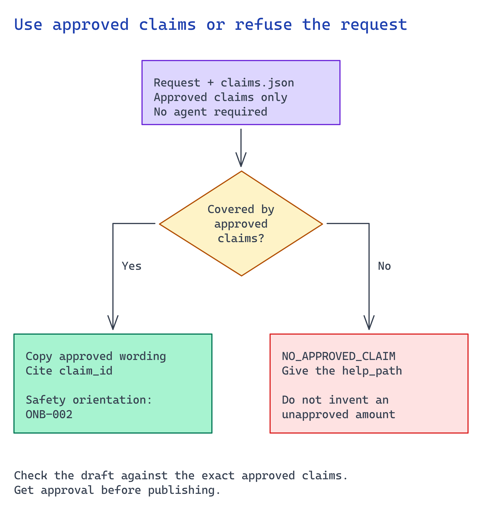

# Module 4. Add grounded authoring or live answers when needed

**Skip model-based drafting when the script is already approved.** A content-production application can
render that wording directly in module 5. Use this module when authors need help selecting
approved statements or when your live experience must answer questions.

Bring module 3's approved source revision and representative questions from the intended users.
For a live experience, include a question the user may not access and one the sources cannot answer.

Use module 2's chat deployment and module 3's approved claim set. The default drafting path below
needs no new agent or sample corpus.



## What you build

1. A grounded generation path, model-with-retrieval **or** a Foundry agent, that produces script
   text traceable to approved claims.
2. Guardrails: cite every claim and **abstain** when no approved claim covers the question. Route
   the user to the claim's `help_path`.
3. A retrieval boundary that limits the assistant to approved content (module 3's corpus / knowledge
   base).

## Choose your path

| Option | What it is | Grounding | Build effort | Best when |
| --- | --- | --- | --- | --- |
| **A. Model + retrieval (grounded prompt)** *(default)* | Chat deployment + your retrieval over the claim set, with a strict system prompt | You control the prompt and the citations | Low | The claim set is small and you want maximum control over refusal/citation |
| B. Foundry agent + knowledge base | A named, versioned Foundry agent with a knowledge tool | Managed retrieval + citations from the knowledge base | Medium | You want a reusable, governed agent that other channels share |
| C. Foundry agent + agentic retrieval (Foundry IQ) | Agent over a permission-aware knowledge base | Query planning + answer synthesis + ACL enforcement | Medium/High | Content spans systems and needs permission-aware retrieval |

**Default: Option A** for the pilot: a chat deployment retrieves from the small approved claim set,
and its system prompt forbids ungrounded statements. It is the smallest setup with direct control
over citations and refusals. Choose B when you want a
named, versioned agent shared across channels (including module 5 Option C, Voice Live). Choose
**C** when retrieval must be permission-aware across systems.

**Migration work.** Moving from A to B or C retains the claim set, module-7 golden questions, and
refusal contract. Replace the drafting call with an agent invocation. Moving from B to A replaces
the agent invocation with a model call. All three options use the module-7 evaluation set.

## Implementation

### Connect your approved content

In your private application, replace the sample claim-file path with the approved content loader
from module 3. Have it reject expired or unapproved revisions before calling the model. Keep
source references with the response so the renderer or reviewer can check them.

For assisted authoring, save a candidate script for review. Return changed wording to module 3's
content approval before rendering. For live answers, enforce access on each request and connect
the refusal to an actual support route. Test the answer path as an intended user, rather than only
as the developer who owns the resources.

### Option A. Model + retrieval (default)

**Ground on the claim set and forbid invention.** Make the system prompt explicit:

```python
SYSTEM_PROMPT = """You draft onboarding script text for a synthetic avatar presenter.
Rules:
1. State only facts present in the provided APPROVED CLAIMS. Never paraphrase policy.
2. For each sentence, cite the claim_id you used.
3. If no approved claim covers the request, start with "NO_APPROVED_CLAIM", then name the relevant help_path.
4. Never invent benefits, dates, amounts, or obligations.
"""
```

**Draft against approved claims only** (keyless, `DefaultAzureCredential`):

```python
import json, os
from pathlib import Path
from azure.identity import DefaultAzureCredential, get_bearer_token_provider
from openai import AzureOpenAI

claims = json.loads(Path("scenarios/avatar-onboarding/accelerator/sample-data/claims.json").read_text())
approved = "\n".join(f'{c["claim_id"]}: {c["approved_wording"]} (help: {c["help_path"]})'
                     for c in claims["claims"])

token_provider = get_bearer_token_provider(
    DefaultAzureCredential(), "https://cognitiveservices.azure.com/.default")
client = AzureOpenAI(
    azure_endpoint=os.environ["AZURE_AI_FOUNDRY_ENDPOINT"],
    azure_ad_token_provider=token_provider,
    api_version="2024-10-21",
)

def draft(question: str) -> str:
    resp = client.chat.completions.create(
        model=os.environ["AZURE_AI_MODEL_DEPLOYMENT_NAME"],
        messages=[
            {"role": "system", "content": SYSTEM_PROMPT},
            {"role": "user", "content": f"APPROVED CLAIMS:\n{approved}\n\nDraft: {question}"},
        ],
        temperature=0,
    )
    return resp.choices[0].message.content
```

> Search before you implement. Confirm the current `AzureOpenAI` / Foundry chat signature and
> `api_version` against Microsoft Learn because the SDK changes. Keep the same onboarding rule:
> **draft only from `claims.json`, cite `claim_id`, refuse with `NO_APPROVED_CLAIM`.**

**Enforce refusal downstream.** Module 5's renderer rejects script segments whose spoken text is
not an *exact* approved claim. A paraphrase or invented sentence cannot render. The model is the
first gate; the renderer is the backstop.

### Option B. Foundry agent + knowledge base

This optional path needs a named, versioned agent with a knowledge tool over module 3's
corpus. In the existing Foundry project, create the agent with the drafting instructions above.
Select module 2's model deployment and connect only approved claims. Test one supported
question and one unsupported question in the playground before saving the version.
Store its name and version in the scenario `.env` as `AZURE_FOUNDRY_AGENT_NAME` and
`AZURE_FOUNDRY_AGENT_VERSION`. Confirm that knowledge citations map to approved claim IDs.
Do not add an agent to a content-production workflow merely to finish this module.

### Option C. Foundry agent + agentic retrieval (Foundry IQ)

When retrieval must be permission-aware, use a Foundry IQ knowledge base behind the agent. Use the
preview API version for query planning and answer synthesis, pass the end-user token in
`x-ms-query-source-authorization`, and keep the "approved claims only" instruction. Reference
from the AI Grounding stack:
<https://learn.microsoft.com/azure/search/agentic-retrieval-how-to-create-knowledge-base>

The assistant may draft *candidate* script text under any option. A **human still approves** the
final wording in module 3 before rendering. Module 6 approves publication. The assistant produces
drafts; it cannot authorize publication.

## Verify

Test citations and refusals before connecting this assistant to an avatar. It must cite
supported answers and refuse unsupported ones. Run both against your deployment, not a fixture.
This grounded call uses your Entra identity, with no key:

```bash
set -a; source scenarios/avatar-onboarding/accelerator/.env; set +a
TOKEN=$(az account get-access-token --scope https://cognitiveservices.azure.com/.default --query accessToken -o tsv)

ask () {
  CLAIMS=$(jq -r '.claims[] | "\(.claim_id): \(.approved_wording) (help: \(.help_path))"' \
    scenarios/avatar-onboarding/accelerator/sample-data/claims.json)
  jq -n --arg q "$1" --arg claims "$CLAIMS" '{
    temperature: 0,
    messages: [
      {role:"system", content:"You draft onboarding script text. Use the exact wording of facts in APPROVED CLAIMS and cite the claim_id you used. If no approved claim covers the request, start with NO_APPROVED_CLAIM, then name the relevant help_path. Never invent benefits, dates, or amounts."},
      {role:"user", content:("APPROVED CLAIMS:\n" + $claims + "\n\nDraft: " + $q)}
    ]}' | curl -s -H "Authorization: Bearer $TOKEN" -H "Content-Type: application/json" -d @- \
    "$AZURE_AI_FOUNDRY_ENDPOINT/openai/deployments/$AZURE_AI_MODEL_DEPLOYMENT_NAME/chat/completions?api-version=2024-10-21" \
    | jq -r '.choices[0].message.content'
}
```

**1. An on-claim question is answered from an approved claim and cites it.**

```bash
ask "When do I select benefits?"
```

The response must state the approved wording and name `ONB-001`. If it paraphrases the policy or drops
the citation, tighten the system prompt and keep `temperature` at 0. A paraphrased policy becomes
an unapproved claim.

**2. An off-claim question is refused, not invented.**

```bash
ask "How much is the parking subsidy?"
```

The only acceptable output is `NO_APPROVED_CLAIM` and the help path. If the response invents a
dollar figure, do not connect the assistant to rendering.
A `401`/`403` means you are missing the **Cognitive Services OpenAI User** role on the account.
Grant it and stay keyless.

## Next module

[Module 5. Generate the accessible avatar experience](05-experience-generation.md) turns an approved
script revision into a disclosed, captioned experience with a non-avatar fallback.
