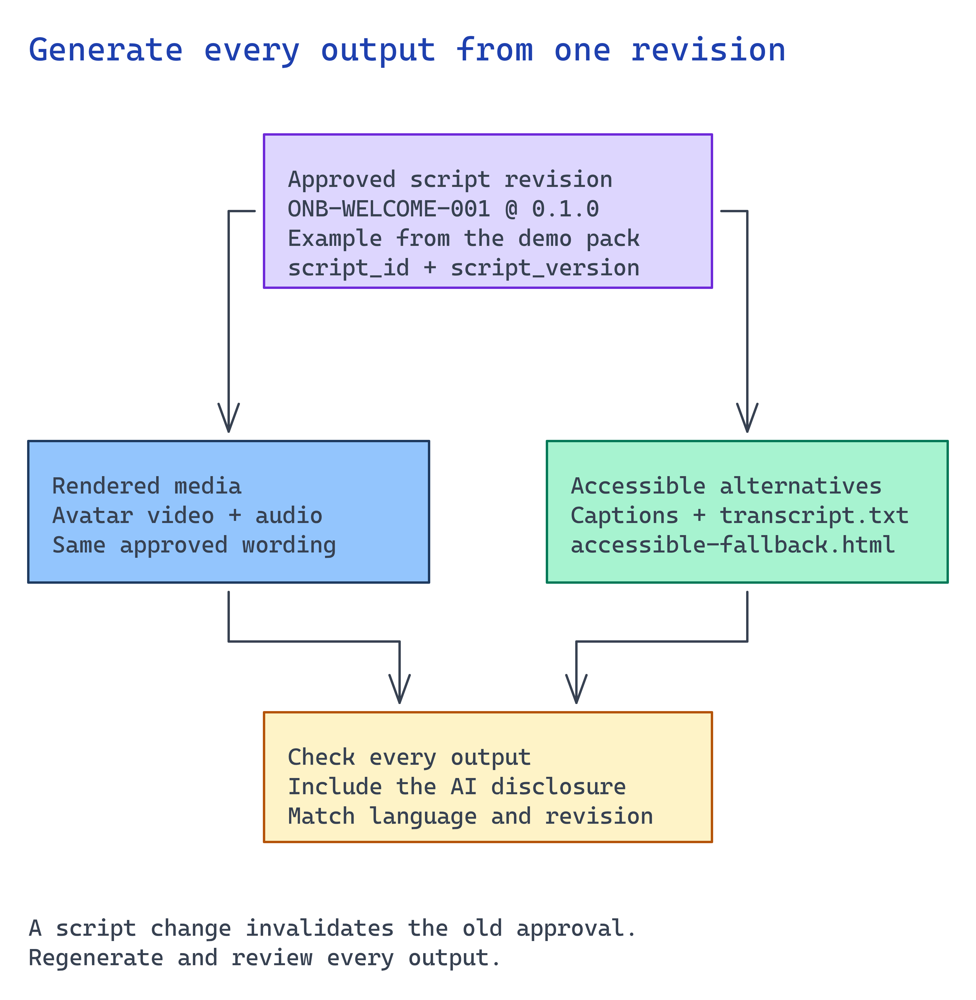

# Module 5 — Connect generation to the application

For content production, connect generation to the workflow and render a **private preview from
the wording approved in module 3**. For an interactive assistant, connect the client to module 4's
answer path. Include disclosure and accessible alternatives in both. Module 6 approves release.

Current Speech guidance is cited inline where service behavior affects the implementation.



## What you build

1. The rendered experience, a talking-avatar video, real-time stream, Voice Live session, or plain
   audio, produced from the approved artifact.
2. **Disclosure** that the presenter is synthetic/AI-assisted, shown/spoken to the user.
3. **Captions + a transcript** and a **non-avatar fallback** (an accessible HTML/audio path) that
   carry the same approved content.
4. **Locale handling** so the right voice/language is used per cohort.

The pack contract, [`accelerator/content_pack.py`](../accelerator/content_pack.py), is deterministic
and offline. It validates the approved pack and builds a traceable artifact record
**without calling a paid service or embedding a real likeness**. Use it to rehearse the pipeline
safely. Its artifact record is **not** a Speech request body; a rendering adapter must map it
to the service request.

## Choose your path

The module-1 capability determines the branch. Every branch needs disclosure and an accessible text
path. Test the accessibility features of the actual output.

| Option | How you generate | Output | Latency | Best when |
| --- | --- | --- | --- | --- |
| A. Batch avatar synthesis | REST job: submit SSML → poll → download mp4 | Reviewable video file | Async (seconds–minutes) | A content-production workflow generates reusable media |
| B. Real-time avatar | Speech SDK + WebRTC stream | Live avatar in the browser | Sub-second | An interactive kiosk/agent showing a face |
| C. Voice Live (avatar or audio) | Managed speech-to-speech WebSocket | Live spoken (optionally avatar) agent | Sub-second | A conversational onboarding assistant |
| D. Plain audio | TTS narration | Audio + transcript | Either | An audio-first experience, alongside the required text fallback |
| E. Video translation | Translate the approved source video, then review each locale | Localized video and transcript | Async | Existing approved video needs another language |

**There is no default rendering path.** Batch synthesis and translation serve content production;
real-time rendering serves interactive assistance. Choose the branch agreed in module 1.
Every option must ship an equivalent accessible text fallback; audio narration is optional.

**Migration cost.** A → B/C is the module-1 batch-to-streaming rebuild (WebRTC/TURN or Voice Live
client). Keep the text fallback available regardless of the media option.

## Implementation

### Connect batch rendering to your content-production application

Build the adapter in your customer-owned repository. It must load the approved revision from
module 3, verify its approval is still valid, and map only that wording into the service request.
Persist a job ID with the source revision and output location. Handle failed or timed-out jobs
explicitly; retry only under the selected service's job contract.

Have the deployed workflow submit and monitor the job. Retain its state across restarts and
prevent repeated triggers from creating duplicate jobs or publications. Give operators a way
to inspect failures and resume a job without bypassing approval.

Store the completed output in private tenant storage and return a preview link to authorized
reviewers. Keep the transcript and fallback with the same revision. **Do not serve the temporary
render URL as the public publication channel.** Module 6 controls release into that channel.

The requests below illustrate the batch service shape using fictional wording. Replace that
wording through the approved-content adapter, rather than editing ad hoc text into a request.

### Option A — Batch avatar synthesis

**Optional reference check.** [`content_pack.py`](../accelerator/content_pack.py) demonstrates
exact-claim matching and rejection of incomplete fictional approvals. It accepts a demo-specific
pack and does not authenticate a content approver. Use the checks as adapter examples. Module 3's
real approval remains the prerequisite for rendering:

```bash
python3 -c "import sys; from pathlib import Path; \
sys.path.insert(0, 'scenarios/avatar-onboarding/accelerator'); \
from content_pack import validate_pack, build_artifact; \
pack = validate_pack(Path('scenarios/avatar-onboarding/accelerator/sample-data')); \
print(build_artifact(pack))"
```

A pack whose spoken text is not an exact approved claim raises `PackRejectedError`. Passing this
local check proves only the reference contract; it does not approve your content or generate media.

**Submit the real batch job (verified API).** The approved artifact becomes an SSML batch request:

```
PUT https://{resource}.cognitiveservices.azure.com/avatar/batchsyntheses/{SynthesisId}?api-version=2024-08-01
```

```json
{
  "inputKind": "SSML",
  "inputs": [{ "content": "<speak version='1.0' xml:lang='en-US'><voice name='en-US-AvaMultilingualNeural'>Complete your benefits selection in the employee portal during your first week.</voice></speak>" }],
  "avatarConfig": {
    "talkingAvatarCharacter": "lisa",
    "talkingAvatarStyle": "casual-sitting",
    "videoFormat": "Mp4",
    "subtitleType": "soft_embedded"
  }
}
```

Poll `GET …/batchsyntheses/{id}` until `status` is `Succeeded`, then download `outputs.result`
(the mp4). For keyless access, send an Entra bearer token in the `Authorization` header and redact
it in logs and docs. This works only when module 2 set the custom subdomain. Limits are payload ≤
500 KB, ≤ 200 concurrent jobs, and ≤ 20-minute output.
<https://learn.microsoft.com/azure/ai-services/speech-service/text-to-speech-avatar/batch-synthesis-avatar>

`subtitleType: soft_embedded` adds captions to the video. Still ship the standalone transcript and
HTML fallback.

### Option B — Real-time avatar

Choose this branch only for the live experience agreed in module 1. Connect the browser to module
4's answer path rather than sending unrestricted text to the renderer. Keep service credentials
off the client. Implement connection expiry and interruption, then test a disconnect and a
question outside the approved sources. An authorized user must still be able to reach text
or human support when video fails.

Use the Speech SDK to open a WebRTC session: fetch ICE details from the Speech REST API, create the
peer connection, then `new SpeechSDK.AvatarConfig("lisa", "casual-sitting")` and a voice such as
`en-US-Ava:DragonHDLatestNeural`. Requires **Standard S0** and outbound access to
`relay.communication.microsoft.com` (UDP 3478 / TCP 443). Show the disclosure in the UI before the
avatar speaks, render live captions, and keep the Option D fallback one click away.
<https://learn.microsoft.com/azure/ai-services/speech-service/text-to-speech-avatar/real-time-synthesis-avatar>

### Option C — Voice Live (avatar or audio)

Voice Live is the managed speech-to-speech path and can emit avatar visuals. Bind it to the module-4
agent (agent mode, Entra auth) so spoken answers stay grounded. This optional extension needs a
client that handles session setup, streamed audio, cancellation, and authentication renewal.
Disclose the synthetic voice at session start, both spoken and on-screen, and offer the
transcript/fallback.
<https://learn.microsoft.com/azure/ai-services/speech-service/voice-live>

### Option D — Plain audio and the text fallback

Synthesize the approved claims as narration with a standard neural voice, ship the transcript, and
serve `accessible-fallback.html` (semantic HTML, `lang` set, `<main>` landmark) with the same
content and no avatar. Screen-reader users, low-bandwidth users, and anyone who opts out of the
avatar receive this path. The sample fallback is
[`accessible-fallback.html`](../accelerator/sample-data/accessible-fallback.html).

### Option E — Translate an existing video

Use the [video translation guidance](https://learn.microsoft.com/azure/ai-services/speech-service/video-translation-overview)
for the selected service's current input and job requirements. Submit the approved source video
from module 3 through an authorized input path. Keep its version with the translation job and
save the translated video and transcript as a new locale revision.

Have a language reviewer compare the meaning with the approved source, including amounts and
obligations. Correct errors before publication approval. This path needs a translation adapter
and a review process; the batch-avatar request above does not translate existing video.
Continue to module 6 with both the source and translated revision references.

### Disclosure & accessibility are non-negotiable (verified)

- **Disclose the synthetic nature** of the voice/avatar to users — required for standard *and*
  custom. Design guidance:
  <https://learn.microsoft.com/azure/foundry/responsible-ai/speech-service/text-to-speech/concepts-disclosure-guidelines>
- **Never** render a real person's face or voice in this repo or a demo. Custom likeness requires the
  limited-access + consent path from module 1.
- Ship captions when the service supports them, plus a transcript and a non-avatar fallback. The
  local validator checks text files and a captions flag; it does not inspect generated captions or
  media.

## Verify

For content production, trigger one approved revision through **your deployed workflow**, then open
the private preview as its reviewer. Confirm that the media, transcript, and fallback all match that revision. A user
outside the preview audience must not receive the media. Repeat the trigger and confirm it reuses
the job. Interrupt processing and confirm the operator can recover it from persisted state.

For a live branch, run one supported question and one refused question through the actual client.
For translation, retain the language review against the source video. The batch commands below
are a service smoke check; they do not replace these application checks.

**1. Submit a batch synthesis job with your Entra token and watch the result.** This proves keyless
Speech and gives you an artifact to inspect. Submit one approved claim as SSML:

```bash
set -a; source scenarios/avatar-onboarding/accelerator/.env; set +a
TOKEN=$(az account get-access-token --scope https://cognitiveservices.azure.com/.default --query accessToken -o tsv)
JOB=onb-verify-001

curl -s -X PUT -H "Authorization: Bearer $TOKEN" -H "Content-Type: application/json" \
  "$AZURE_SPEECH_ENDPOINT/avatar/batchsyntheses/$JOB?api-version=2024-08-01" \
  -d '{
    "inputKind": "SSML",
    "inputs": [{"content": "<speak version=\"1.0\" xml:lang=\"en-US\"><voice name=\"en-US-AvaMultilingualNeural\">Complete your benefits selection in the employee portal during your first week.</voice></speak>"}],
    "avatarConfig": {"talkingAvatarCharacter": "lisa", "talkingAvatarStyle": "casual-sitting", "videoFormat": "Mp4", "subtitleType": "soft_embedded"}
  }' | jq '{id, status}'

# Poll until Succeeded, then read the output URL:
curl -s -H "Authorization: Bearer $TOKEN" \
  "$AZURE_SPEECH_ENDPOINT/avatar/batchsyntheses/$JOB?api-version=2024-08-01" | jq -r '.status, .outputs.result'
```

`status` moves `NotStarted → Running → Succeeded`. Download `outputs.result` (a time-limited SAS
URL) and play the mp4. Expect the standard `lisa` avatar to speak the exact approved wording with
soft-embedded captions. For `401`, check the token and custom-subdomain endpoint (module 2).
For `403`, check **Cognitive Services Speech User** and RBAC propagation. Use only the selected
standard avatar; a realistic-looking avatar alone does not mean you selected a custom likeness.
Custom likenesses need module 1's approval and consent checks.
<https://learn.microsoft.com/azure/ai-services/speech-service/text-to-speech-avatar/batch-synthesis-avatar>

**2. The experience carries a disclosure, and the non-avatar fallback carries the same content.** A
video with no disclosure and no accessible path is a compliance incident, not a demo:

```bash
jq -e '.disclosure | length > 0' \
  scenarios/avatar-onboarding/accelerator/sample-data/storyboard-script.json

grep -qi 'avatar-generated or AI-assisted' scenarios/avatar-onboarding/accelerator/sample-data/transcript.txt \
  && grep -qi 'benefits selection' scenarios/avatar-onboarding/accelerator/sample-data/accessible-fallback.html \
  && grep -qi 'lang=' scenarios/avatar-onboarding/accelerator/sample-data/accessible-fallback.html \
  && echo "disclosure + fallback carry the approved content"
```

Both must succeed. A missing disclosure lets an undisclosed synthetic presenter reach users. A
fallback without the approved wording or a `lang` attribute excludes screen-reader and low-bandwidth
users. Ship captions, a transcript, and the non-avatar page for every option.
<https://learn.microsoft.com/azure/foundry/responsible-ai/speech-service/text-to-speech/concepts-disclosure-guidelines>

## Next module

[Module 6 — Gate publication behind human approval](06-approval-gating.md) requires named human
sign-off and a withdrawal path before anything reaches an employee.
