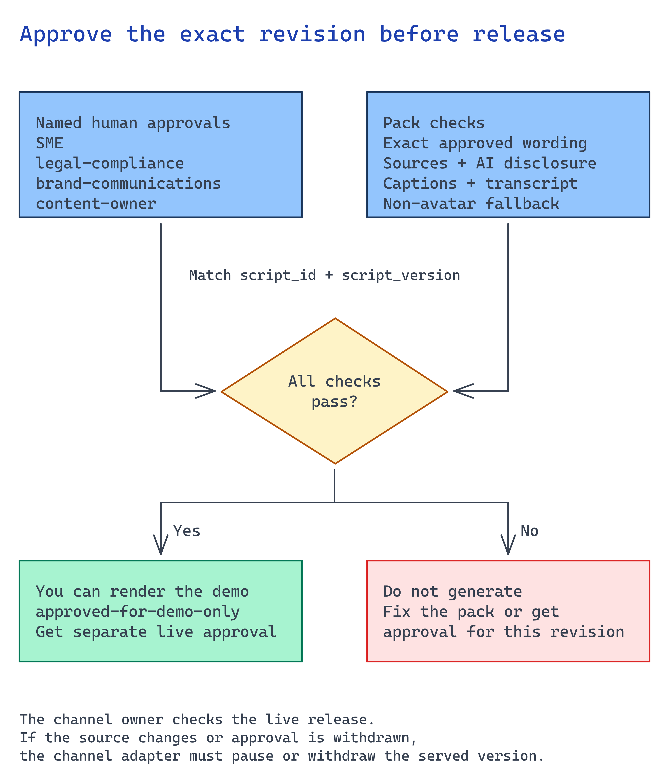

# Module 6. Approve publication and prove withdrawal

For content production, module 3 approved the wording and module 5 produced a private preview.
Approve the complete experience and make the publishing action enforce that decision.
Reviewers must see the media with its disclosure and accessible alternatives. For an interactive
assistant, review the application version and its content/refusal policy in the actual client.

## What you build

A publishing operation in the customer's channel that accepts only an authorized approval for
the exact media or application revision. A withdrawal operation removes that revision when its
source expires, consent changes, or an owner reports a defect.

Bring the private preview, source approval, target channel, and people authorized to approve and
operate it. Agree required reviewers with the customer. The reference pack's SME,
legal/compliance, brand, and content-owner roles illustrate one policy; they are not a substitute
for the customer's policy.

## Choose your path

| Approval mechanism | Choose it when | Implementation you own |
| --- | --- | --- |
| **Existing publishing/content system** | Content owners already release material in a portal, learning platform, or content management system. | Bind its approval to the immutable media revision and make the publish operation verify that decision. Use its native withdrawal and history where available. |
| Protected release pipeline | The application and content are already released through CI/CD. | Present the exact artifact to required reviewers, protect the release environment, and allow only the release identity to publish. Approval must be invalidated when the artifact changes. |
| Power Automate / Logic Apps approval flow | Business reviewers work in the organization's approval tools rather than a code pipeline. | Create an approval for the preview and revision, verify the completed decision, and call a narrowly scoped publishing operation. Implement expiry, rejection, and withdrawal separately. |
| ITSM change control | The customer requires a formal change before content or applications reach users. | Link the revision to the change, enforce its approval at release, and connect emergency withdrawal to the customer's incident process. |

**Prefer the system the customer already operates.** None of these choices needs a second
hand-maintained approval ledger in this repository. Keep a durable reference to the authoritative
decision with the published artifact.

The local `approvals.json` fixture is only a contract example. Its validator does not authenticate
reviewers or remove served media, so it cannot be the publication authority for a tenant build.

## Implementation

### Bind the decision to the preview

1. Store the preview as an immutable revision, including the media and text alternatives.
   Calculate a content hash or use the publishing system's immutable artifact identifier.
2. Create the approval in the selected system. Show reviewers the preview and source references,
   intended audience, and disclosure. Record the decision against that revision.
3. Have the publishing operation recheck reviewer authorization and approval status immediately
   before release. Reject changed content, expired approvals, and a withdrawn source.
4. Publish through a scoped service identity. Save the channel's publication ID with the revision
   and approval reference so the operator can find and withdraw it later.

For example, a reviewer approves video revision 4 in the content system. Replacing the transcript
creates revision 5; the release must stop until revision 5 is approved. A filename or a mutable
"latest" link is insufficient to bind the decision.

### Connect your selected approval mechanism

**Content system:** use its approved-state transition as the release gate. Confirm users cannot
reach draft media through a direct file URL that bypasses the channel. Test source expiry as well
as manual withdrawal.

**Pipeline:** package the media and alternatives into one immutable release artifact. Configure
the protected environment and required reviewers before the publishing job. Reject a release
that references another artifact, even if an earlier pipeline run was approved.

**Approval flow:** include the revision ID and preview link in the approval request. On completion,
load the decision from the approval service; do not trust a caller-supplied `approved: true`.
Recheck the revision before invoking the publisher. A timeout or partial approval must leave the
preview private. Connect a rejected or withdrawn source to the unpublish operation.

**ITSM:** make the deployment job check the approved change and the referenced artifact. Keep the
change ID in the channel's release history. Agree who can pause access during an incident without
waiting for the normal release schedule.

### Implement withdrawal in the serving channel

Map source revisions to publication IDs. When a source expires or an owner withdraws approval,
block new publication and remove access to the affected published revision. Handle cached copies
and alternate URLs under the channel's actual capabilities; document any copies you cannot recall.

Serve a clear unavailable message with the support route instead of the outdated explanation.
Test restoration only after a replacement revision has been approved.

For a live experience, approve the deployed application version and its content/refusal policy.
Withdrawal disables the affected knowledge or experience. Do not claim that each generated
answer has received human approval.

## Verify

Run these checks through the **actual publishing operation and user channel**:

| Attempt | Required result |
| --- | --- |
| Publish without the required approval | Rejected; preview remains private. |
| Publish after editing an approved artifact | Rejected because the revision no longer matches. |
| Release the approved revision | Intended users can access the media and equivalent text. |
| Access as a user outside the audience | Denied, including direct media access. |
| Withdraw its source or approval | Published access stops under the agreed withdrawal window; the operator can see the reason. |

Keep the publication and approval references in the customer's release history. A local JSON flag
does not prove any of these outcomes.

To inspect the reference pack's rejection behavior separately, run from the repository root:



```bash
python3 -m unittest discover -s scenarios/avatar-onboarding/accelerator -p test_content_pack.py
```

Use these tests during adapter development. Tenant acceptance still requires the checks above.

## Next module

[Module 7. Evaluate and operate](07-prove-and-operate.md). Prove the complete experience through
the selected channel and hand over operations to its owner.
