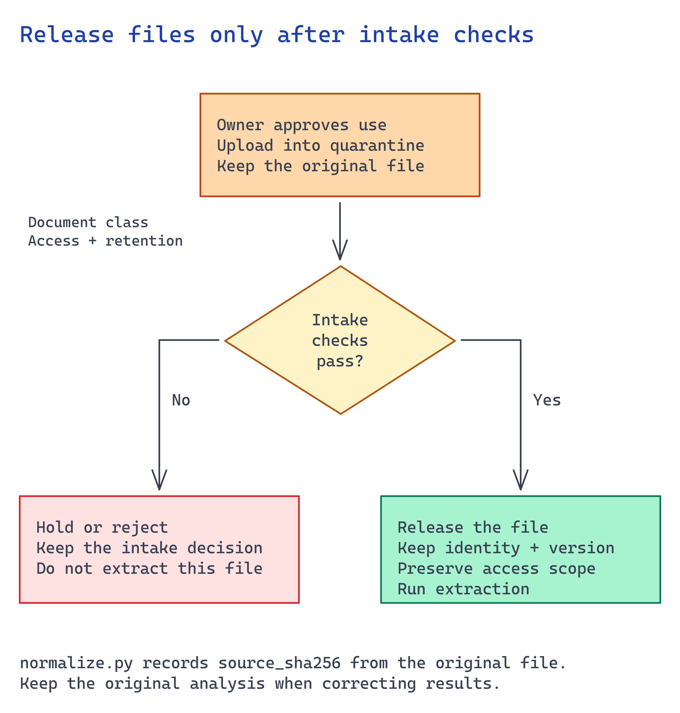

# Module 2 — Connect an approved document source

This module defines which documents can enter the workflow and how their identity, version, and
permissions stay with them. You can tune extraction later. An unapproved document breaks governance.

**Bring a representative file from the agreed document class.** Have its owner approve processing
and retention in the tenant. If access is not approved yet, use a synthetic document to check the
connector, but keep customer acceptance blocked. No PDF is supplied by this repository.



## What you build

1. A source decision: which system is authoritative for the documents you extract.
2. An intake contract: required metadata (source URI, version, owner, hash, sensitivity) and rules
   that route documents to quarantine.
3. A **runnable intake check** that confirms the plan is complete and containers are private and
   keyless.

## Choose your path

| Option | Reaches | Permission model | Build effort | Status |
| --- | --- | --- | --- | --- |
| **A. Azure Blob Storage** *(default)* | Files you upload / land via pipeline | RBAC on the container; account MI reads by URL | Low | GA |
| B. ADLS Gen2 | Hierarchical lake data | POSIX ACLs (≤32 per file) + RBAC; ACLs can carry forward to a search index | Medium | GA |
| C. SharePoint | Documents users already own | Inherited M365 / Entra permissions; indexer or Graph | Medium | Indexed = preview, Remote = preview |
| D. OneLake (lakehouse) | Fabric lakehouse files | Fabric workspace RBAC | Medium | GA as a knowledge source |

**Default: Option A.** Blob is the simplest approved-content boundary: one RBAC-controlled container
the account's managed identity reads by URL, plus a quarantine container. Content Understanding and
Document Intelligence both accept blob URLs directly, so the analyzer needs no extra pipeline.

**Choose B when** documents already live in a data lake and require directory-level ACLs. **Choose C
when** documents belong in SharePoint and their owners should manage permissions there. Do not copy
them to Blob and create a second permission model. **Choose D when** documents are curated with
analytical data in a Fabric lakehouse.

**Migration cost.** Moving from A to B, C, or D changes the ingestion step and source type.
Extraction and review still read the same typed result. Moving from C to A also requires a copy and
new permission design, so avoid it unless there is a clear reason.

### The intake decision, stated precisely

Answer these before you write code:

1. **Which system is authoritative** for each document class, and who owns it?
2. **What metadata must travel** with every document — source URI, version, ingested-by, SHA-256,
   sensitivity label, permission owner IDs?
3. **What sends a document to quarantine** — unapproved class, unauthorized source, unsupported type
   or size, missing sensitivity label?
4. **How long is a document retained**, and who signed off on that window?

## Implementation

### Option A — Azure Blob Storage (default)

Use the approved inbound and quarantine containers from module 1. The optional template creates
them for a new environment. Set `SOURCE_FILE` to an actual approved PDF in your private workspace,
or export a representative document to PDF from its source application. Retain the exact bytes
for module 4's hash; do not substitute a later copy.

The upload below uses an illustrative invoice identifier. Replace its metadata with your source
reference and classification:

```bash
# Run from the repository root; keep the source outside this public repository.
SOURCE_FILE="/absolute/path/to/approved-invoice.pdf"
set -a; source scenarios/content-understanding/accelerator/.env; set +a
ACCOUNT="$AZURE_STORAGE_ACCOUNT_NAME"

az storage blob upload \
  --account-name "$ACCOUNT" --auth-mode login \
  --container-name documents-inbound \
  --name invoice-2002.pdf --file "$SOURCE_FILE" \
  --metadata source_uri="procurement/2026/invoice-2002.pdf" source_version="1" \
             ingested_by="$(az ad signed-in-user show --query userPrincipalName -o tsv)" \
             sensitivity_label="Confidential"
```

Implement the intake rule before admitting a file. Route a failed rule to `documents-quarantine`,
never `documents-inbound`, and retain its rejection reason. Test an unapproved document class and
an unauthorized source as well as the accepted input.

Confirm the analyzer's supported input authorization as well as the storage role. A caller's
access to a private URL does not automatically make that URL readable by the service. Module 3
describes the approved upload path when analyze-by-URL is not available for your configuration.

### Option B — ADLS Gen2

Same storage account with hierarchical namespace enabled. Set directory ACLs so permissions travel
with the document, and record that you will carry them forward when the content is indexed:

```bash
az storage fs access set \
  --account-name "$ACCOUNT" --auth-mode login \
  --file-system documents-inbound --path procurement \
  --acl "user::rwx,group::r-x,other::---"
```

Know the limit before you commit to this path: **≤32 ACL entries per file/directory**. Past that,
redesign to group-based permissions. Reference:
<https://learn.microsoft.com/azure/search/search-indexer-access-control-lists-and-role-based-access>

### Option C — SharePoint

Keep documents in SharePoint. Connect the library and let M365 enforce permissions for the signed-in
user. As a knowledge source, SharePoint is available **indexed** (ingested before query time) or
**remote** (fetched at query time). For document extraction, you typically use Microsoft Graph to
retrieve a specific file, then give its bytes or short-lived URL to the analyzer.

Build that file-read adapter under an approved identity. Preserve the item ID and source version,
then pass the exact bytes through the same intake rules as option A. Do not treat a retrieval
knowledge-source connection as a document-processing connector. Check an allowed and denied item
before continuing to module 3; the Blob commands do not verify this branch.

Confirm that library permissions reflect intent. Inherited permissions on a "public" site often surprise teams. Test with a low-privilege account.
Reference:
<https://learn.microsoft.com/azure/search/agentic-knowledge-source-overview>

### Option D — OneLake (lakehouse)

Use this when the source owner already manages the files in a Fabric lakehouse. Implement an
authorized file read from the selected workspace and preserve the file reference and version.
Submit those bytes through the chosen analyzer's supported input path. A knowledge-source
connection alone does not perform this extraction handoff.

Agree retention for any staging copy and prove that a denied source cannot reach analysis.
Continue to module 3 with the same document identity and intake evidence. Reference:
<https://learn.microsoft.com/fabric/onelake/onelake-access-api>

## Verify

Check one accepted and one rejected input through **your source adapter**. Confirm the exact
document reaches analysis and retains its source identity. For SharePoint or OneLake, inspect
those reads and intake results in the selected platform; the following checks apply to Blob.

**1. Both containers exist and neither is public.**

```bash
for C in "$AZURE_DOCUMENTS_CONTAINER_NAME" "$AZURE_QUARANTINE_CONTAINER_NAME"; do
  az storage container show --account-name "$AZURE_STORAGE_ACCOUNT_NAME" \
    --name "$C" --auth-mode login --query "{name:name, public:properties.publicAccess}" -o tsv
done
```

You want both names with an empty `public` column. A value of `blob` or `container` exposes the
document corpus anonymously. If the command succeeds, Entra data-plane access works.
`AuthorizationFailure` means your identity still lacks **Storage Blob Data Contributor**.

**2. Intake metadata actually rode with the document.**

```bash
az storage blob metadata show --account-name "$AZURE_STORAGE_ACCOUNT_NAME" --auth-mode login \
  --container-name "$AZURE_DOCUMENTS_CONTAINER_NAME" --name invoice-2002.pdf -o json
```

You should see `source_uri`, `source_version`, `ingested_by`, and `sensitivity_label`. Missing values
mean the pipeline cannot trace the document's origin or who admitted it.

**3. The analyzer identity can read inbound documents by URL.**

```bash
ACCOUNT=$(echo "$AZURE_CONTENT_UNDERSTANDING_ENDPOINT" | sed -E 's#https?://([^.]+)\..*#\1#')
MI=$(az cognitiveservices account show --name "$ACCOUNT" \
  --resource-group "$(az cognitiveservices account list --query "[?name=='$ACCOUNT'].resourceGroup | [0]" -o tsv)" \
  --query identity.principalId -o tsv)
STORAGE_ID=$(az storage account show --name "$AZURE_STORAGE_ACCOUNT_NAME" --query id -o tsv)
az role assignment list --assignee "$MI" --scope "$STORAGE_ID" \
  --query "[].roleDefinitionName" -o tsv
```

Confirm the required role for the selected input path, then submit the document in module 3.
A role listing does not prove the analyzer can read the private input.

## Next module

[Module 3 — Select the extraction capability](03-extraction-selection.md) chooses how these
documents become typed fields, across every Microsoft option.
