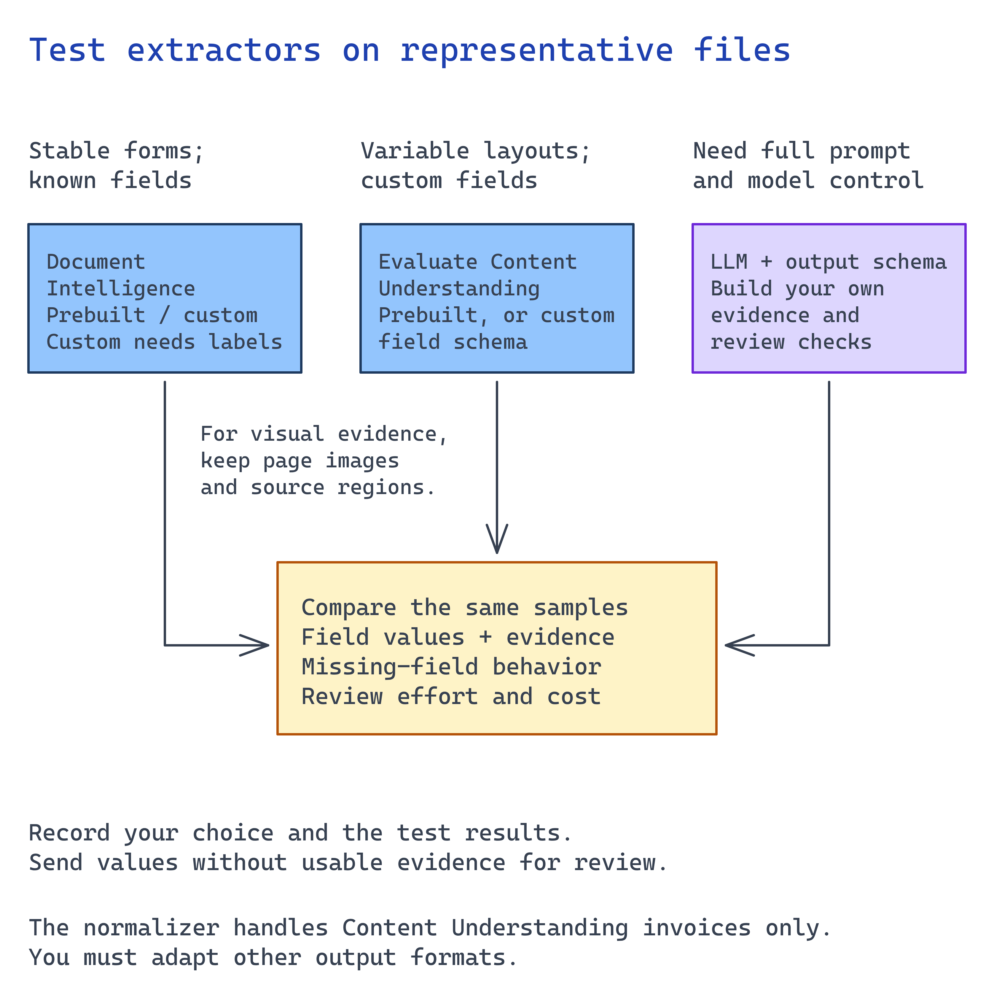

# Module 3 — Select the extraction capability

This is the central customer decision. Several Microsoft options fit different work. A deterministic
model can miss fields in free-form documents; an LLM can waste tokens and invent values on stable
forms. Record the choice and fallback.

Bring the fields agreed in module 1 and representative documents from module 2. Include one
ordinary document and one difficult case. **Choose by observed field quality and review effort
on these inputs**, rather than by a product label.



## What you build

An extraction path with a model or analyzer ID, confidence threshold, evidence requirement, and
fallback behavior.

## Choose your path

Use the current Microsoft Learn guidance when choosing the capability:
<https://learn.microsoft.com/azure/ai-services/content-understanding/choosing-right-ai-tool>

| Option | What it is | Confidence + grounding | Labels needed | Wins when | Fails when |
| --- | --- | --- | --- | --- | --- |
| **A. Content Understanding prebuilt analyzer** *(default)* | LLM-powered analyzers (`prebuilt-invoice`, `-contract`, `-read`, `-layout`, `-documentSearch`) | Yes (0–1 + source spans) | None | Semi-structured / high-variation docs, RAG prep, reasoning, multimodal | Ultra-high-volume, latency-critical, cost-sensitive stable forms |
| B. Content Understanding custom analyzer | Zero-shot schema you describe in plain language; optional labels/knowledge source | Yes (`estimateFieldSourceAndConfidence`) | None (zero-shot) or few | Custom fields on unstructured docs (policies, letters, notes) | You need deterministic template accuracy |
| C. Document Intelligence prebuilt model | Purpose-trained deterministic models (Invoice, Receipt, ID, tax, mortgage…) | Yes (0–1 + bounding regions) | None | Standard structured forms with common templates; low latency, proven accuracy | Free-form or highly variable layouts |
| D. Document Intelligence custom model | Template/neural model you train on labeled samples | Yes | Yes (labeled) | Highly structured, org-specific forms (claims, applications) | You have no labels or layouts vary a lot |
| E. LLM structured outputs (build your own) | Azure OpenAI JSON-schema extraction | **No native confidence/grounding** — you implement it | None | Niche workflows needing full control of model + prompt | You need built-in evidence or straight-through automation with audit |
| F. Multimodal / vision extraction | CU image/vision analyzers or a vision LLM over page images | Yes (CU) / No (raw vision) | None | Charts, diagrams, photos, handwriting, mixed media | Pure text where OCR + fields is cheaper and more accurate |

**Default: Option A.** Content Understanding prebuilt analyzers return schema-aligned fields *with
confidence and grounding* without labeling. The same service can reach Document Intelligence models,
so you can specialize without changing stacks.

**When each other option wins**

- **B** — you need fields no prebuilt analyzer covers on documents too variable for a template.
  Describe fields in plain language and iterate quickly.
- **C** — documents are standard structured forms (invoice, receipt, ID, W-2, 1003). Deterministic
  models lead on accuracy and latency here, and cost less than an LLM per page.
- **D** — the form is organization-specific and highly structured, and you can label samples.
  You trade labeling effort for template-grade accuracy.
- **E** — you need control of the model, prompt, and infrastructure, and will implement confidence
  and grounding yourself. Select this build-your-own path deliberately.
- **F** — value lives in a chart, diagram, photo, or handwriting. Use a multimodal analyzer. Do not
  force visual content through a text-only pipeline. Scope image-input validation and
  reviewer-visible regions before choosing this alternative.

**Migration cost.** Moving between A and C is cheap: both are Foundry Tools on the same account and
return module 4's typed result contract. Swap the analyzer or model ID, then verify again. Moving
from A or C to E rebuilds extraction and adds validation code because it provides no confidence or
grounding. B and D add iteration or labeling but retain the contract. Prefer options that provide
evidence.

## Implementation

### Compare against the required fields

Have the document owner mark the correct values and evidence before running an analyzer.
For each required field, record whether the candidate returned the right value, located its
source, or correctly left it empty. Compare latency and processing cost at the expected volume.

Use a prebuilt analyzer when its fields fit. If important fields are missing, define a custom
schema and compare it on the same documents. For a trained model, include the labeling and retraining work in the decision. For raw LLM output,
assign evidence checking and missing-value handling before accepting that branch.

The following requests show the service calls. Keep the selected analyzer/model ID and field
mapping in your application configuration. All branches continue to module 4; only the supplied
Content Understanding invoice mapper is implemented in the reference code. Other branches
need a mapper that preserves the same evidence and review contract.

Each option below produces the typed result that module 4 consumes. Set the confidence threshold once,
then enforce it everywhere.

### Option A — Content Understanding prebuilt analyzer

GA API version **`2025-11-01`**. Async: `POST …:analyze` → `202` + `Operation-Location`, then poll.

```bash
set -a; source scenarios/content-understanding/accelerator/.env; set +a
CU="${AZURE_CONTENT_UNDERSTANDING_ENDPOINT%/}"
TOKEN=$(az account get-access-token --resource https://cognitiveservices.azure.com --query accessToken -o tsv)

curl -s -D - -X POST \
  "$CU/contentunderstanding/analyzers/prebuilt-invoice:analyze?api-version=2025-11-01" \
  -H "Authorization: Bearer $TOKEN" -H "Content-Type: application/json" \
  -d '{"inputs":[{"url":"https://<account>.blob.core.windows.net/documents-inbound/invoice-2002.pdf"}]}'
# → 202; copy the Operation-Location header, then GET it until "status":"Succeeded"
```

The URL must be readable by the service through an approved access path; a private Blob URL
does not become readable because your caller has an Entra token. For a local synthetic PDF,
use Content Understanding Studio to upload it and export the completed JSON response.
Keep the original PDF bytes for module 4's source hash.

Before the first call, configure the selected analyzer's model deployment mappings in
Content Understanding Studio using this scenario's account. The deployment script does not
set those mappings. Confirm that the selected analyzer returns field confidence and source
evidence; otherwise use a custom analyzer with `estimateFieldSourceAndConfidence: true`.
Current setup:
<https://learn.microsoft.com/azure/ai-services/content-understanding/concepts/models-deployments>

**Wait for completion before normalizing.** Capture the `Operation-Location` header as `OP`.
This loop saves a completed result or fails after five minutes:

```bash
mkdir -p scenarios/content-understanding/accelerator/.runtime
ANALYSIS=scenarios/content-understanding/accelerator/.runtime/analysis.json
for attempt in $(seq 1 150); do
  curl --fail-with-body -sS -H "Authorization: Bearer $TOKEN" "$OP" -o "$ANALYSIS" || break
  STATUS=$(jq -r '.status' "$ANALYSIS")
  if [ "$STATUS" = Succeeded ] || [ "$STATUS" = Failed ]; then break; fi
  sleep 2
done
jq -e '.status == "Succeeded"' "$ANALYSIS"
```

Do not continue if the final check fails. Refresh an expired token; inspect a failed operation's
error instead of treating an empty field set as a successful extraction.
Scalar values use `valueString`, `valueNumber`, or `valueDate`. Amounts can be nested under
`valueObject.Amount`; module 4's normalizer handles the invoice mapping.

### Option B — Content Understanding custom analyzer

Create an analyzer that describes your fields and turns on evidence, then analyze with its id:

```bash
curl -s -X PUT \
  "$CU/contentunderstanding/analyzers/rvas-rfq?api-version=2025-11-01" \
  -H "Authorization: Bearer $TOKEN" -H "Content-Type: application/json" \
  -d '{
        "description": "RFQ fields for procurement",
        "config": { "estimateFieldSourceAndConfidence": true },
        "fieldSchema": { "fields": {
          "RfqNumber":   { "type": "string", "method": "extract" },
          "DueDate":     { "type": "date",   "method": "extract" },
          "TotalBudget": { "type": "number", "method": "extract" }
        }}
      }'
```

`estimateFieldSourceAndConfidence` makes confidence and grounding appear in the result. Field methods
are **extract** (as-written), **classify** (from a set), or
**generate** (summaries/descriptions). Reference:
<https://learn.microsoft.com/azure/ai-services/content-understanding/overview>

### Option C — Document Intelligence prebuilt model

Deterministic, keyless, v4.0 GA (`2024-11-30`). `pip install azure-ai-documentintelligence`.

```python
from azure.identity import DefaultAzureCredential
from azure.ai.documentintelligence import DocumentIntelligenceClient
from azure.ai.documentintelligence.models import AnalyzeDocumentRequest
import os

client = DocumentIntelligenceClient(os.environ["AZURE_DOCUMENT_INTELLIGENCE_ENDPOINT"], DefaultAzureCredential())
poller = client.begin_analyze_document(
    "prebuilt-invoice",
    AnalyzeDocumentRequest(url_source="https://<account>.blob.core.windows.net/documents-inbound/invoice-2002.pdf"))
for doc in poller.result().documents:
    total = doc.fields["InvoiceTotal"]
    print(total.value_currency, total.confidence, total.bounding_regions)
```

Model ids include `prebuilt-invoice`, `prebuilt-receipt`, `prebuilt-idDocument`, `prebuilt-tax.us.w2`,
`prebuilt-layout`, `prebuilt-read`. Reference:
<https://learn.microsoft.com/azure/ai-services/document-intelligence/overview?view=doc-intel-4.0.0>

### Option D — Document Intelligence custom model

Choose this when the organization can maintain labeled examples for its document class.
Use Document Intelligence Studio to prepare and train the model under the current model's
requirements. Keep separate examples for evaluation; training-file success is not acceptance.
Call its ID through the option C client, then map its output in module 4.

Assign ownership of new layouts and failed extractions. The ongoing labeling and evaluation
work is part of this choice; do not promise accuracy before measuring it.

### Option E — LLM structured outputs (build your own)

Full control, **no native confidence or grounding**. You must implement validation and evidence.

```python
from pydantic import BaseModel
from openai import OpenAI
from azure.identity import DefaultAzureCredential, get_bearer_token_provider

tp = get_bearer_token_provider(DefaultAzureCredential(), "https://ai.azure.com/.default")
client = OpenAI(base_url="https://<res>.openai.azure.com/openai/v1/", api_key=tp)

class Invoice(BaseModel):
    invoice_number: str
    total_due_usd: str

out = client.beta.chat.completions.parse(
    model="chat",
    messages=[{"role":"system","content":"Extract only fields present; never infer a value."},
              {"role":"user","content": document_markdown}],
    response_format=Invoice)
```

There is no confidence score, so define an evidence strategy. For example, require the model to return
a source span for each field and reject any field it cannot locate. Record the strategy in the
decision. Reference:
<https://learn.microsoft.com/azure/foundry/openai/how-to/structured-outputs>

### Option F — Multimodal / vision extraction

When the value lives in a chart, diagram, photo, or handwriting, use a Content Understanding image
analyzer (`prebuilt-imageSearch`, or a custom analyzer with `generate` fields) so you still get
confidence and grounding, or a vision-capable LLM over rendered page images if you are on Option E.
Do not push visual content through a text-only OCR path and hope.

For a visual-input extension, accept only approved file types and sizes, preserve the page/image
reference for each observation, and route uncertain observations to a person. Treat image text
as untrusted content. This alternative needs a mapping into module 4's result contract;
the invoice default does not require it.

## Verify

Test the selected capability on a real document, then on a messy one. A decision file that names an
analyzer does not prove it works on your documents.

**1. The chosen analyzer returns typed fields with confidence and grounding.**

For the Content Understanding default, analyze one real inbound document and read the result:

```bash
CU=$(echo "$AZURE_CONTENT_UNDERSTANDING_ENDPOINT" | sed 's:/*$::')
TOKEN=$(az account get-access-token --resource https://cognitiveservices.azure.com --query accessToken -o tsv)
OP=$(curl -s -D - -o /dev/null -X POST \
  "$CU/contentunderstanding/analyzers/prebuilt-invoice:analyze?api-version=2025-11-01" \
  -H "Authorization: Bearer $TOKEN" -H "Content-Type: application/json" \
  -d "{\"inputs\":[{\"url\":\"https://$AZURE_STORAGE_ACCOUNT_NAME.blob.core.windows.net/$AZURE_DOCUMENTS_CONTAINER_NAME/invoice-2002.pdf\"}]}" \
  | tr -d '\r' | awk 'tolower($1) == "operation-location:" {print $2}')

# Poll until "status":"Succeeded", then inspect a field's confidence and source.
curl --fail-with-body -sS -H "Authorization: Bearer $TOKEN" "$OP" \
  | jq '.result.contents[0].fields | to_entries[0].value | {value: (.valueString // .valueNumber // .valueDate), confidence, source}'
```

A `confidence` between 0 and 1 and a non-null `source` (the `D(page,...)` grounding polygon) show
that the capability provides evidence. A null `source` means the path does not ground values. That is
expected for Option E, where you must implement the evidence strategy. For Document Intelligence,
read `field.confidence` and `field.bounding_regions` from the Python SDK result.

**2. It survives a document outside your happy path.**

Run the same call against a document with a different layout, a scan, or a vendor you did not design
for. Compare the returned fields to what you can see in the source document.

If obvious fields come back empty or confidence collapses across the document, use the fallback.
Do not lower the threshold until results look acceptable.

## Next module

[Module 4 — Implement typed extraction with evidence](04-typed-extraction.md) turns the chosen
capability's output into one validated result that fails safely.
