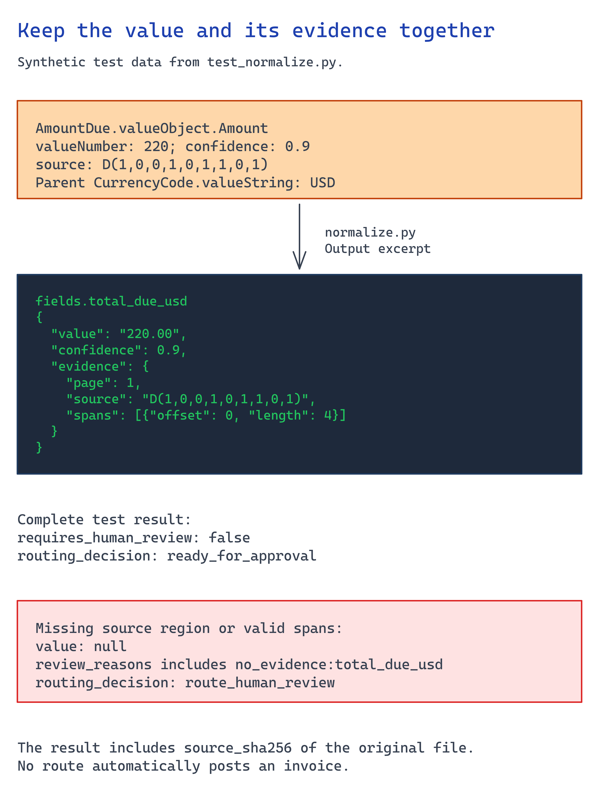

# Module 4 — Implement typed extraction with evidence

Normalize the completed analysis from module 3. **A value without source evidence cannot
proceed.** Keep the original response so a reviewer can inspect what was rejected.



## What you build

A result tied to the original document hash, with field confidence and source spans.
Missing values and conflicting invoice totals produce explicit review reasons.

## Choose your path

| Path | Implementation | Boundary |
| --- | --- | --- |
| **Content Understanding invoice** (default) | Supplied `normalize.py` | One invoice, using the synthetic USD field mapping |
| Custom document or RFQ | Adapt `FIELD_PATHS` and document-specific rules | Requires a reviewed mapping for the chosen analyzer |
| Document Intelligence or LLM output | Write a mapper to the same evidence contract | Do not invent confidence or source evidence |

The default maps invoice number, purchase order, supplier, and the invoice amounts. It
preserves zero values and reads nested `valueObject.Amount` fields. Missing or non-USD
currency codes clear the accepted USD value and force review; the mapper does not convert currencies.

The mapping follows the [Content Understanding invoice schema](https://github.com/Azure/content-understanding-toolkit/blob/main/prebuilt-schema/2025-11-01/procurement/invoice.md).
Prebuilt generated amounts can lack source evidence or confidence. Those fields require
review; do not manufacture either to make the normalizer pass.

## Implementation

Run from the repository root. `--source` must identify the exact file submitted in module 3,
not a later transcription or converted copy.

```bash
python3 scenarios/content-understanding/accelerator/normalize.py \
  --analysis scenarios/content-understanding/accelerator/.runtime/analysis.json \
  --source "/absolute/path/to/the-analyzed-synthetic-invoice.pdf" \
  --document-id invoice-2002 --threshold 0.85 \
  --output scenarios/content-understanding/accelerator/.runtime/result.json
```

The normalizer rejects incomplete service operations. It walks the declared fields rather
than only the fields returned, so an omitted field cannot disappear silently.

Each field retains `value`, `confidence`, and `evidence`. Evidence includes the page parsed
from `D(page,...)`, the original region string, and text spans. A missing region or invalid
span clears the accepted value and adds `no_evidence:<field>`. The original analysis still
contains the rejected candidate.

Missing confidence forces review; it is never treated as a high score. A confidence below
the chosen threshold adds `low_confidence:<field>`. The invoice rule also checks whether
subtotal plus tax equals the total.

**Normalization never approves payment.** Clean results become `ready_for_approval`.
Exceptions become `route_human_review`. Module 5 handles the human decision separately.
The older plain-value files in `sample-data/expected/` are comparison labels, not service
responses or authorization to post.

For a custom analyzer, edit the field mapping and its business rules together. Carry the
same document hash and review behavior into the adapted mapper. For LLM output, verify
each quoted span against the source; absent confidence still requires review.

## Verify

Run the local behavioral checks:

```bash
python3 -m unittest discover -s scenarios/content-understanding/accelerator -p test_normalize.py
```

They exercise missing evidence and confidence, zero values, and conflicting totals. They
do not call Azure or establish extraction accuracy.

Inspect the result from your actual analysis:

```bash
jq '{document_id, source_sha256, routing_decision, review_reasons, fields}' \
  scenarios/content-understanding/accelerator/.runtime/result.json
```

Open the original document at an amount's page and region. Confirm the returned value
matches what a person sees. A plausible region string alone does not establish grounding.

Then copy the analysis, remove one field's confidence, and normalize the copy. It must
route to review. Remove its source region too: the accepted value must become `null`.
Keep this damaged copy out of the approved input set.

## Troubleshooting

| Failure | Action |
| --- | --- |
| Analysis is not `Succeeded` | Finish module 3's polling or inspect the service error |
| All fields are missing | Inspect the analyzer's field names and adapt `FIELD_PATHS` |
| Amount has no evidence | Inspect the nested `Amount` field and analyzer evidence configuration |
| Every document needs review | Inspect confidence and mapping before changing the threshold |
| Source hash differs from the label | Review the exact submitted file; do not copy a fixture hash |

## Next module

[Module 5 — Build review, correction, and handoff](05-human-review.md). Present the result
and original analysis to the reviewer without overwriting either.
