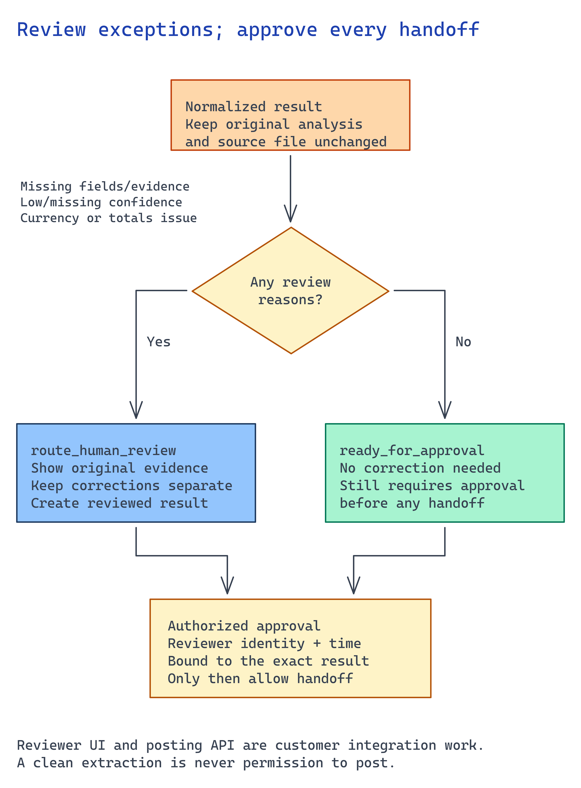

# Module 5 — Build review, correction, and handoff

Module 4 raises exceptions; this module resolves them. A reviewer sees missing and low-confidence
fields, corrects them, and approves the result. Keep every correction as evidence. Never silently
overwrite extraction, and send corrections to module 6's evaluation.



## What you build

1. A review queue that routes exceptions to a named reviewer with the document, extracted fields, and
   grounding evidence.
2. A correction record that keeps the field, original value, corrected value, and reason.
3. A governed handoff where approved results cross one seam to the downstream system as the workflow
   identity, with an auditable trace.

## Choose your path

Make two decisions separately. **Where does the reviewer work?** Prefer the customer's existing
case queue or workflow when it can show the source evidence and capture a correction. Build a
dedicated review app when reviewers need side-by-side documents or region overlays. That adds UI
and authorization work, but does not change the downstream write contract.

Then choose how the approved result reaches its destination:

| Handoff | Choose it when | Work required |
| --- | --- | --- |
| **Application calls a bounded posting API** | The next action is known after approval. | Authenticate the reviewer, check the exact approved payload, and post under a scoped workflow identity. No agent is required. |
| Agent proposes an action-tool call | The surrounding application already uses an agent to choose work. | Expose a narrow proposal contract. Application code must still check approval and dispatch the write; a tool schema grants no permission. |
| Existing workflow coordinates the handoff | The customer already manages long-running review in a workflow system. | Persist the case and approval while waiting, then call the same posting API. Preserve the correction history and destination receipt across retries. |

These choices can coexist. A rich review app can use the first handoff, and an agent can route a
case into an existing human workflow. Use the smallest extra infrastructure that serves the
reviewer's actual task.

## Implementation

### Build the review-to-posting path

Connect module 4's result to the chosen queue. Each case must show the original document,
review reasons, and extracted evidence. Give an authorized reviewer a way to correct a field
and submit the exact reviewed revision for approval.

Implement one posting operation for the agreed destination. For example, create a draft record
rather than granting unrestricted update access. Define its input schema with the destination
owner and retain its returned record/operation ID. Use the same operation whether application
code or an agent proposed the handoff.

Route exceptions to a queue, let a reviewer correct them, then post the approved result through one
action tool. Record the correction **before** handoff and never mutate the original result:

```python
from datetime import datetime, timezone

def apply_correction(result, field, corrected_value, reviewer_id, reason):
    if not reviewer_id.strip() or not reason.strip():
        raise ValueError("A reviewer and correction reason are required")
    original = result["fields"][field]["value"]
    correction = {"field": field, "original_value": original,
                  "corrected_value": corrected_value, "reason": reason}
    # New reviewed copy — the original extraction is retained as evidence.
    reviewed = {**result, "fields": {**result["fields"],
                field: {**result["fields"][field], "value": corrected_value, "corrected": True}}}
    trace = {"document_id": result["document_id"], "reviewer_id": reviewer_id,
             "reviewed_at": datetime.now(timezone.utc).isoformat(),
             "source_sha256": result["source_sha256"],
             "review_outcome": "approved_with_correction",
             "corrections": [correction],
             "handoff": {"target_seam": "procurement_posting_action_tool", "approved": True}}
    return reviewed, trace
```

Save the function in your workflow module and apply it to module 4's `result.json` after the
reviewer checks the document. Write the returned copy to `reviewed-result.json` and the trace
to `trace.json`; retain the original. Resolve every review reason before creating an approval.
The example records one correction. Repeat the review for each flagged field.

**Build the handoff against one approved destination contract.** Use these steps here:

1. Define `post-approved-result` to accept the document ID, source hash, reviewed values,
   and a unique operation ID. Reject unknown fields and an unapproved result.
2. Authenticate the reviewer separately. Bind their decision to the exact reviewed payload
   and hash; reject changed or expired approvals at dispatch.
3. Give the workflow identity only the permission needed for that operation. The model
   may propose a handoff, but application code checks approval before calling the destination.
4. Make the destination reject conflicting reuse of an operation ID and return a durable
   receipt. Keep that receipt with the review trace. A retry must not post a second result.

The customer-specific posting API and reviewer UI are integration work. For a synthetic
walkthrough without that API, stop at the reviewed result and approval trace. Mark the
handoff unimplemented; do not claim that a local JSON record changed a business system.
Modules 6 and 7 must retain that boundary.

### When building a dedicated review app

Give reviewers the document with grounding overlays and editable flagged fields. On approval, the app
writes the same correction record and calls the same handoff seam. The app captures reviewer identity,
timestamp, before-and-after values, and reason, so its trace matches Option A. Only the reviewer
experience changes.

### When using an existing agent workflow

If this workflow is one agent among several, use an explicit handoff. An agent can prepare the
typed result and correction record, but a **named human** must approve the result before the
workflow calls the action tool. Module 7 contains the hosting steps; orchestration does
not replace the approval check at the destination.

## Verify

**Complete one case in the actual reviewer surface.** Correct a flagged value and submit it through
the posting adapter. Inspect the destination independently, then repeat the same operation ID and
confirm no duplicate appears. Deny a second case and confirm the destination remains unchanged.
If posting is outside the agreed release, verify the reviewed-result handoff to its named owner and
keep posting disabled.

Check the trace written by your review step, then check who may trigger the handoff. Write the
approval trace to `trace.json` and inspect it.

**1. The correction is retained, not an overwrite.**

```bash
jq 'select(.review_outcome == "approved_with_correction")
    | {reviewer: .reviewer_id, at: .reviewed_at,
       corrections: [.corrections[] | {field, original_value, corrected_value, reason}],
       seam: .handoff.target_seam, approved: .handoff.approved}' trace.json
```

Every correction needs a `reviewer_id`, `reviewed_at`, `reason`, and `original_value` that differs
from `corrected_value`. If `original_value` is absent or unchanged, the review overwrote extraction
and lost before-and-after evidence. Module 6 uses these records as test cases, so a silent overwrite
also corrupts the evaluation set.

**2. The handoff refuses a caller who is not an approver.**

Call the approved action-tool seam as a signed-in identity that lacks the approver role.
Set `ACTION_API_AUDIENCE` to the API's registered token audience; it may differ from its URL:

```bash
TOKEN=$(az account get-access-token --resource "$ACTION_API_AUDIENCE" --query accessToken -o tsv)
curl -sS -o /dev/null -w '%{http_code}\n' -H "Authorization: Bearer $TOKEN" \
  -X POST "$ACTION_API_URL/post-approved-result" -d @trace.json -H "Content-Type: application/json"
```

First confirm that a permitted approver can submit a synthetic result. Then repeat the same
request with a valid token for a non-approver; expect `403`. A `401` alone tests authentication,
not the approver-role boundary. Any successful non-approver response fails the check.

**3. The post is attributed to the workflow identity.**

In the downstream system (or Application Insights traces), confirm the approved result arrived once
with the workflow identity and `document_id`, rather than the reviewer's personal account.
Keep `reviewer_id` in the approval record so the service identity does not hide who approved it.

## Next module

[Module 6 — Evaluate and trace the workflow](06-prove-and-observe.md) turns the corrections you just
retained into an evaluation gate and reviewable traces.
