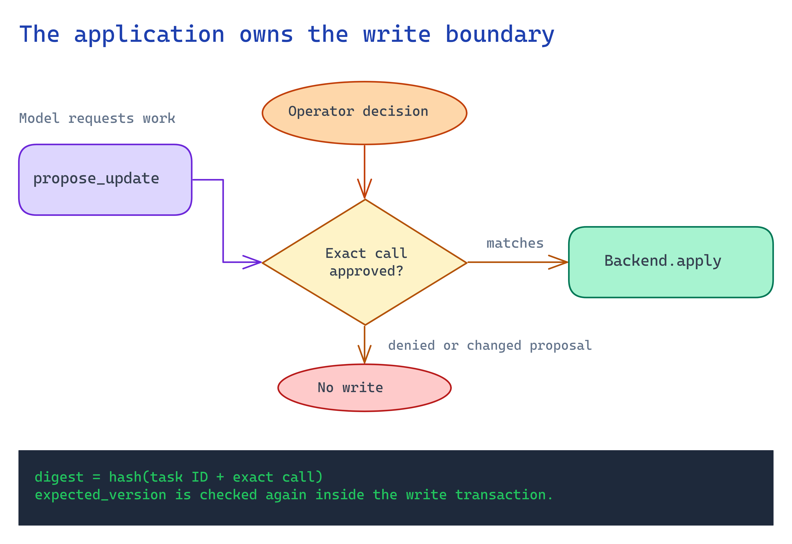

# Module 6 - Approve an exact operation

Approval belongs to a specific proposal. The model cannot carry it forward to
different arguments or a changed record.



## What you build

A persisted proposal and a separate human decision. The proposal digest binds
the task ID to the exact tool call, including its expected record version.

## Choose your path

| Option | Suitable boundary | Limitation |
|---|---|---|
| **Local CLI approval** | Synthetic exercises run by a trusted operator. | The OS username is attribution only. |
| Authenticated approval service | A customer pilot with real effects. | Requires approver authorization and policy rules. |
| Existing workflow approval | The customer already has an approval system. | Its decision must bind to the exact proposal. |

Retain the requested function and arguments with the human decision and result.
The task ID and proposal digest connect these records across a restart.

## Implementation

Run from the repository root with fresh synthetic state:

```bash
STATE="$(mktemp -d)"
python3 -B scenarios/operational-agents/accelerator/cli.py --state-dir "$STATE" start \
  --allow-writes --fixture scenarios/operational-agents/accelerator/sample-data/update.json
```

Expect `waiting_approval`. Copy the returned `id` and `pending.digest` into `TASK_ID` and
`DIGEST`. Inspect the proposal before approving it:

```bash
TASK_ID="paste-the-task-id"
DIGEST="paste-the-pending-digest"
python3 -B scenarios/operational-agents/accelerator/cli.py --state-dir "$STATE" show "$TASK_ID"
python3 -B scenarios/operational-agents/accelerator/cli.py --state-dir "$STATE" approve "$TASK_ID" --digest "$DIGEST"
python3 -B scenarios/operational-agents/accelerator/cli.py --state-dir "$STATE" resume "$TASK_ID"
python3 -B scenarios/operational-agents/accelerator/cli.py --state-dir "$STATE" records
```

The record must be `reviewed` at version `2`. Repeat `resume`; the version must remain `2`.
Use `deny` instead of `approve` on a fresh task to test refusal. The `approve` command
records a decision; `resume` performs the separately gated operation.

`propose_update` cannot call `Backend.apply` directly. The engine validates the
digest again and fetches the current record version before dispatch. The backend
then checks that version transactionally, closing the concurrent-update gap.

Noninteractive `start` and `resume` stop at `waiting_approval`. They never
interpret model text, tool output, or `--allow-writes` as approval.

Run from the repository root:

```bash
python3 -B scenarios/operational-agents/accelerator/validate.py --case approval
```

## Verify

The suite must prove denial leaves version 1 unchanged. An approved unmodified
proposal reaches version 2 once. A changed digest or stale expected version
must fail without applying the proposed value.

For customer systems, add authenticated approver identity and expiry. Enforce
those checks outside the model and again at the write boundary.

## Next module

[Recover interrupted work](07-recovery.md). Decide how to establish whether a
write committed when the caller never received a result.
