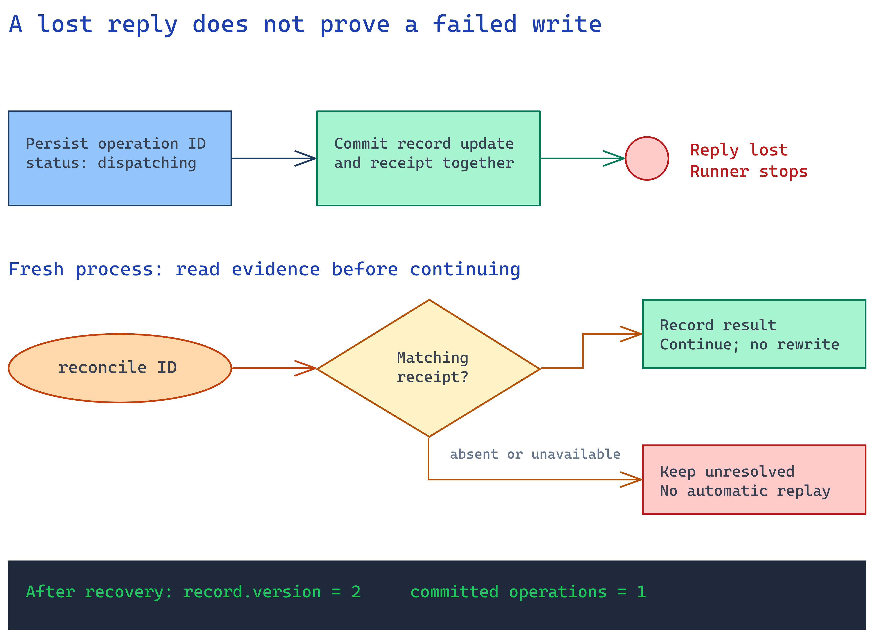

# Module 7 - Recover without replaying uncertain writes

An interrupted caller does not prove an operation failed. Read authoritative
operation evidence before deciding what happened.



## What you build

An operation ID persisted before dispatch, an independent backend receipt, and
a reconciliation command. Inputs are the approved proposal and the destination's
operation lookup contract.

## Choose your path

| Evidence after interruption | Action |
|---|---|
| Matching committed receipt | Record the result and continue. |
| Receipt with different arguments or version | Stop; the evidence contradicts the proposal. |
| No receipt, or lookup unavailable | Keep the outcome unresolved; do not blindly replay. |

The guided path chooses the conservative absence rule. A different destination
may support safe replay with the same idempotency key, but that guarantee needs
its own proof.

## Implementation

Use the [accelerator recovery exercise](../accelerator/README.md#recover-an-interrupted-write)
to interrupt a fresh approved task after the tool commits. Its runner snapshot
still says `dispatching`. The backend ledger already contains the operation.

`reconcile` reads that ledger and compares its result with the approved
arguments. A matching receipt becomes task evidence. No second write occurs.

Repeat before dispatch. With no receipt, the sample must stop at `unresolved`.
A failed lookup is also unresolved, not a successful empty result.

Run from the repository root:

```bash
python3 -B scenarios/operational-agents/accelerator/validate.py --case recovery
```

## Verify

The restart tests use fresh processes and real temporary SQLite files. After
commit, expect one backend operation and record version 2. Before dispatch,
expect zero operations and version 1.

The concurrent-resume test must reject a second process while the first holds
the local task lock. This is single-machine coordination. It does not establish
distributed ownership or survive loss of the state disk.

## Next module

[Evaluate and prepare to operate](08-evaluate-operate.md). Choose the evidence
the customer needs beyond the local recovery proof.
